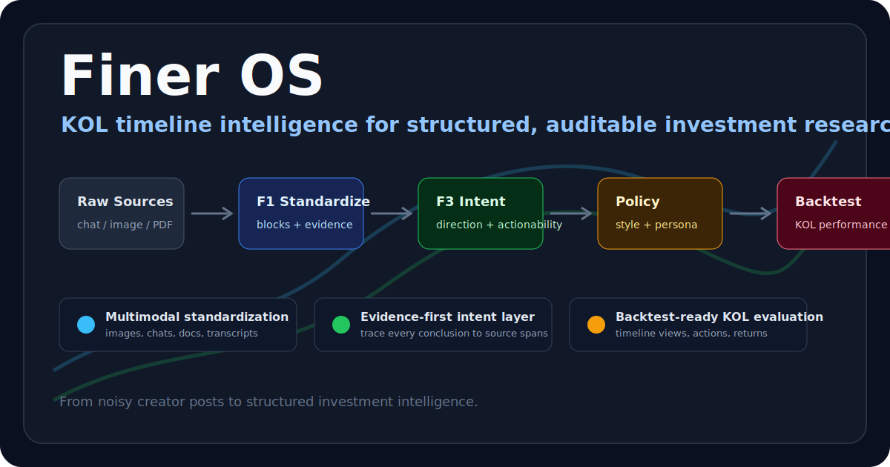
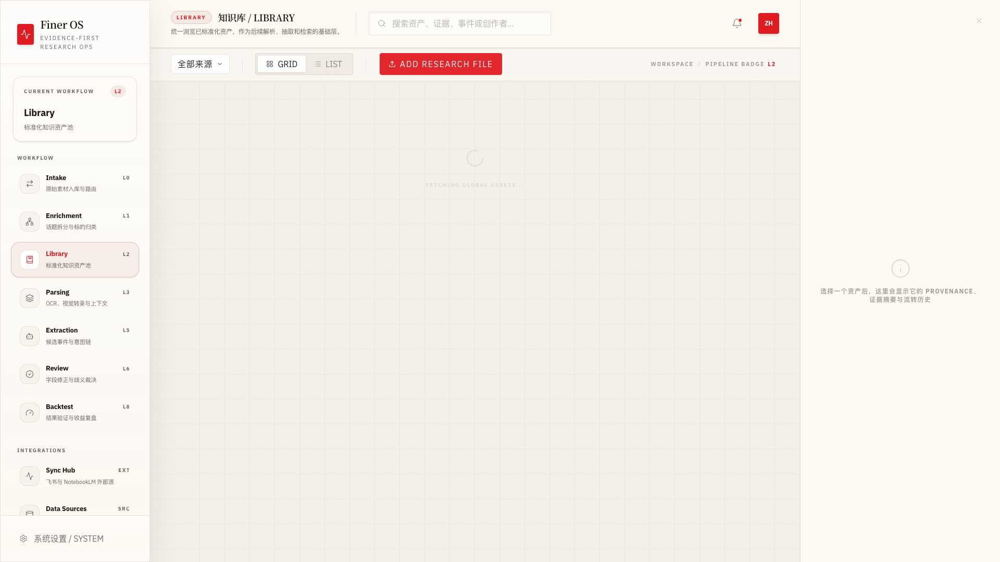
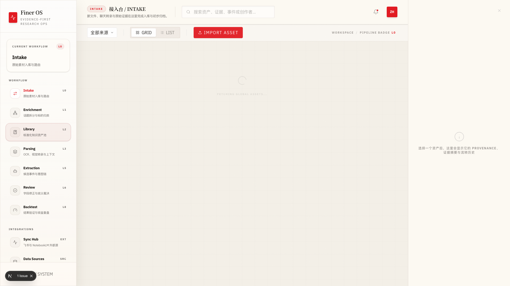

# Finer OS - KOL 投资观点结构化与回测系统

<p align="center">
  
</p>

<p align="center">
  
  
  
  
  
  
</p>

```
███████╗██╗███╗   ██╗████████╗███████╗██████╗ 
██╔════╝██║████╗  ██║╚══██╔══╝██╔════╝██╔══██╗
█████╗  ██║██╔██╗ ██║   ██║   █████╗  ██████╔╝
██╔══╝  ██║██║╚██╗██║   ██║   ██╔══╝  ██╔══██╗
██║     ██║██║ ╚████║   ██║   ███████╗██║  ██║
╚═╝     ╚═╝╚═╝  ╚═══╝   ╚═╝   ╚══════╝╚═╝  ╚═╝
```

> **从非标准 KOL 时间轴内容到可审计投资意图、可执行交易动作与可回测收益评估的研究流水线**

Finer OS 将财经 KOL 的聊天记录、图片策略、飞书文档、PDF、音频/视频转录等复杂内容统一清洗为标准化内容块，再抽取可追溯证据的投资意图，最终映射为可复核、可回测的交易动作，用于评估“如果跟随某个 KOL 交易”的收益、风险和稳定性。

[快速开始](#快速开始) · [功能特性](#功能特性) · [架构设计](#架构设计) · [MiMo Orbit 申请说明](docs/MIMO_ORBIT_APPLICATION.md) · [API 文档](docs/API_REFERENCE.md)

## Why Finer Matters

Financial creators publish high-signal investment reasoning in noisy timelines: long chat logs, image-based strategy posts, Feishu docs, PDFs, livestream transcripts, and short-form market comments. A simple sentiment classifier cannot answer the real question:

> If someone had followed this KOL over time, what would the portfolio outcome have been?

Finer OS is built around that question. It turns unstructured KOL content into evidence-linked investment intents, maps those intents into reviewable trade actions, and connects them to timeline analysis and backtesting. The system is designed for high-volume AI/Agent workflows where large context windows, multimodal parsing, repeated extraction, and multi-agent validation are central.

## MiMo Orbit Fit

Finer is a strong candidate for Xiaomi MiMo 100T because it has a concrete token-intensive workflow:

- **Multimodal standardization**: OCR/image strategy parsing, chat/document cleanup, transcript segmentation.
- **Long-context reasoning**: KOL timelines require cross-document memory, relative-time resolution, and viewpoint evolution.
- **Structured extraction**: natural language statements are converted into `NormalizedInvestmentIntent` with evidence spans.
- **Agent collaboration**: architecture planning, schema contracts, fixture creation, extractor validation, and independent verification are executed as separate agent tasks.
- **Model improvement loop**: outputs are designed for SFT/DPO/RLHF data generation and later local model fine-tuning.

Application-ready materials:
- [MiMo Orbit application note](docs/MIMO_ORBIT_APPLICATION.md)
- [Architecture alignment plan](docs/architecture-alignment-plan.md)
- [Multi-agent execution plan](docs/agent-execution-plan.md)
- [V0/V1 validation report](docs/v0-v1-schema-contract-validation-report.md)
- [Cat Lord fixture contracts](tests/fixtures/kol/)

---

## 📸 界面预览

<p align="center">
  
  <br>
  <em>Dashboard 主界面 - L2 知识库视图</em>
</p>

<p align="center">
  
  <br>
  <em>L0 接入台 - 多源数据导入</em>
</p>

---

## 功能特性

### 🔄 多源数据导入
- **飞书群同步** - 自动拉取聊天记录、图片、文件
- **NotebookLM 集成** - 同步知识库内容
- **B站视频/弹幕** - 支持视频转写与评论抓取
- **微信公众号长图** - OCR 解析金融研报
- **手动上传** - 支持任意格式文件导入

### 🧱 V0/V1 语义标准化
- **ContentEnvelope / ContentBlock** - 将图片、聊天、文档、PDF、转录稿统一成可追踪内容块
- **QualityCard** - 用可读性、完整性、金融相关性、实体解析、时间解析、证据追溯六维评估清洗质量
- **TemporalAnchor / EvidenceSpan** - 保留发布时间、文本提及时间、解析时间、交易生效时间与原文证据
- **NormalizedInvestmentIntent** - 先抽取方向、可操作性、仓位变动暗示、信念强度，再进入交易动作映射

### 🎯 Trade Action 提取
- **意图优先** - 区分“看好宁德时代”和“加仓宁德时代”，避免把观点直接误映射为交易
- **多步操作链** - 从“短期看空520，目标480建仓”提取完整操作序列
- **条件触发器** - 识别价格触发条件、止损止盈点位
- **标的识别** - 支持 A 股、港股、美股代码与公司名映射

### 📊 时间线与观点状态
- **KOL 时间轴** - 以 KOL 为主轴串联同一标的的连续观点
- **跨文档引用** - 支持从历史观点、后续修正、财报变化中恢复观点演化
- **多 KOL 分歧** - 面向同一标的构建多 KOL 共识/分歧分析
- **市场数据融合** - 结合价格、指数、行业与事件上下文

### ⭐ RLHF 评价系统
- **双轨标注** - SFT 修正 + 偏好收集
- **过程奖励模型** - 对推理链每一步独立评分
- **DPO 训练导出** - 一键生成对齐训练数据
- **多维度评估** - 21 维投资观点评估矩阵

### 📈 回测引擎
- **三种回测模式** - Simple Window / Trigger Entry / Action Chain
- **七层评测指标** - 从实体识别到回测收益的全链路评估
- **性能分析** - 胜率、Alpha、夏普比率自动计算

### 🖥️ Finer OS Dashboard
- **多层级视图** - L0 接入台 → L6 复核台 → L8 回测
- **实时预览** - 图片、PDF、Markdown 内嵌预览
- **源过滤** - 按飞书群/NotebookLM/本地区分来源
- **智能命名** - 时间戳文件名自动格式化

---

## 技术栈

| 层级 | 技术选型 | 用途 |
|:---|:---|:---|
| **核心语言** | Python 3.11+ / TypeScript | 后端逻辑 + 前端交互 |
| **Web 框架** | FastAPI + Pydantic V2 | API 服务 + 数据校验 |
| **前端框架** | Next.js 14 + TailwindCSS | Dashboard 工作台 |
| **大模型** | Qwen-VL-Max / DeepSeek / OpenAI | 视觉解析 + 事件抽取 |
| **结构约束** | Instructor | Contract-first 强类型输出 |
| **数据处理** | Data-Juicer / Polars | 数据清洗 + 回测引擎 |
| **RLHF 平台** | 自研 Dashboard | 人工标注 + 偏好收集 |

---

## 快速开始

### 环境要求

- Python 3.11+
- Node.js 18+
- Redis (可选，用于缓存)

### 安装步骤

```bash
# 1. 克隆项目
git clone https://github.com/kelipovanatalja453-bot/finer.git
cd finer

# 2. 安装 Python 依赖
pip install -e .

# 3. 安装前端依赖
cd src/finer_dashboard
npm install
```

### 配置

```bash
# 复制配置模板
cp configs/feishu.yaml.example configs/feishu.yaml

# 编辑配置文件
vim configs/feishu.yaml

# 设置环境变量
export OPENAI_API_KEY="your-key"
export DASHSCOPE_API_KEY="your-key"  # 通义千问
export FINANCE_SKILLS_API_KEY="your-key"  # 可选
```

### 运行

```bash
# 启动后端 API (终端 1)
cd src
uvicorn finer.api.server:app --port 8000 --reload

# 启动前端 Dashboard (终端 2)
cd src/finer_dashboard
npm run dev
```

访问 http://localhost:3000 打开 Dashboard。

---

## 架构设计

### 目标流水线架构

```mermaid
flowchart LR
    S0[Raw Sources] --> V0[V0 ContentEnvelope / ContentBlock]
    V0 --> V05[V0.5 Quality / Time / Entity / Evidence]
    V05 --> V1[V1 NormalizedInvestmentIntent]
    V1 --> V2[V2 Policy Mapping]
    V2 --> V3[V3 TradeAction]
    V3 --> V4[V4 Timeline / Viewpoint State]
    V4 --> V5[V5 Backtest / KOL Evaluation]
    V5 --> V6[V6 Training Data / Model Improvement]
```



### 数据流

```
原始 KOL 内容
    ↓
V0 标准化内容块 + 证据跨度
    ↓
V0.5 质量卡 + 时间锚 + 实体锚
    ↓
V1 投资意图: direction / actionability / position_delta_hint / conviction
    ↓
V2 个性化 policy: 全局基线 / 风格层 / 风险偏好 / KOL 修正
    ↓
V3 可执行 TradeAction
    ↓
V4/V5 时间线、观点状态与跟随交易回测
```

### 核心模块

| 模块 | 职责 | 关键文件 |
|:---|:---|:---|
| **接入层** | 多源数据导入 | `ingestion/feishu_poller.py` |
| **标准化层** | V0 内容容器、质量卡、证据链 | `schemas/content_envelope.py`, `schemas/quality.py` |
| **解析层** | OCR/ASR、图片/聊天/文档 block 化 | `parsing/content_standardizer.py`, `vision_utils.py` |
| **意图层** | V1 投资意图抽取 | `schemas/investment_intent.py`, `extraction/intent_extractor.py` |
| **动作层** | TradeAction 映射 | `extraction/trade_action_extractor.py` |
| **复核层** | 人工校准、RLHF | `api/routes/rlhf.py` |
| **回测层** | 跟随交易模拟与 KOL 评估 | `backtest/`, `timeline/` |

---

## 截图

### Dashboard 主界面


### 事件复核工作台


### L1 富化层视图


---

## API 文档

详细 API 参考请查看 [API_REFERENCE.md](./docs/API_REFERENCE.md)。

### 核心端点

| 端点 | 方法 | 用途 |
|:---|:---|:---|
| `/api/files` | GET | 获取资产列表 |
| `/api/enrichment/split` | POST | 话题分割 |
| `/api/enrichment/extract` | POST | 实体抽取 |
| `/api/review/save` | POST | 保存复核结果 |
| `/api/rlhf/submit` | POST | 提交 RLHF 反馈 |

---

## 开发指南

### 项目结构

```
src/finer/
├── api/              # FastAPI 路由
│   ├── routes/       # 各模块端点
│   └── server.py     # 应用入口
├── enrichment/       # L1 富化层
├── extraction/       # L5 抽取层
├── ingestion/        # 数据接入
├── schemas/          # Pydantic 模型
└── services/         # 外部服务

src/finer_dashboard/
├── src/
│   ├── components/   # React 组件
│   ├── lib/          # 工具函数
│   └── app/          # Next.js App Router
└── package.json
```

### 常用命令

```bash
# 运行测试
pytest tests/

# 格式化代码
black src/finer/
isort src/finer/

# 类型检查
mypy src/finer/

# 缓存预热
curl -X POST http://localhost:8000/api/files/cache/warmup
```

---

## 贡献指南

欢迎贡献代码、报告问题或提出建议！

1. Fork 本仓库
2. 创建特性分支 (`git checkout -b feature/amazing-feature`)
3. 提交更改 (`git commit -m 'feat: add amazing feature'`)
4. 推送到分支 (`git push origin feature/amazing-feature`)
5. 创建 Pull Request

请确保：
- 代码通过 `pytest` 测试
- 遵循 `black` 格式规范
- 新功能有对应测试用例

---

## 许可证

本项目采用 [MIT License](LICENSE) 开源协议。

---

## 致谢

本项目受以下开源项目启发：
- [Instructor](https://github.com/jxnl/instructor) - 结构化输出
- [Data-Juicer](https://github.com/modelscope/data-juicer) - 数据清洗
- [Argilla](https://github.com/argilla-io/argilla) - RLHF 标注
- [MinerU](https://github.com/opendatalab/MinerU) - 文档解析

---

*最后更新: 2026-04-23*
