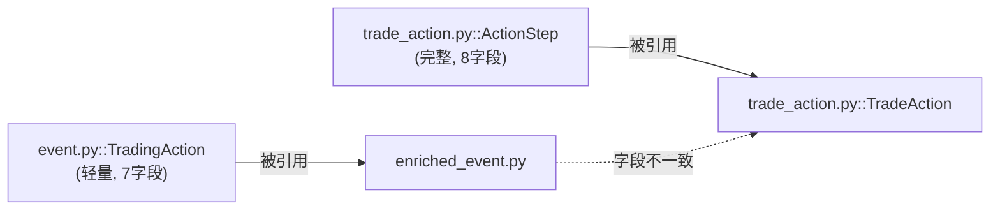

# Finer OS 架构文档审阅：系统构建优化建议

> 基于 `docs/ARCHITECTURE.md` (1213行, v1.0.0) 的深度审阅  
> 对照实际代码逐项验证

---

## 总体评价

这份架构文档的**信息密度和覆盖面都很优秀**——从愿景到目录结构、数据模型、API 参考、前端组件到部署运维都有涉及。但从"系统构建"的角度审视，我识别出 **7 个结构性问题** 和 **5 个值得增加的设计维度**。

---

## 一、结构性问题

### 问题 1：文档与代码的真实性偏差

你的"已实现功能清单"（第 9 章）声称很多模块是 **100% 完成**，但实际代码告诉了不同的故事：

| 文档声称 | 实际情况 | 影响 |
|---|---|---|
| `opinions.py` 观点时间线 **20%** | ✅ 诚实标注 | — |
| L4 聚合 API **100%** | ⚠️ `ContextAggregator` 是**内存态**，重启即丢失，无持久化 | 产品不可用 |
| KOL 评级引擎 **100%** | ⚠️ 数据来源是手动 JSON 文件，没有与流水线打通 | 与流水线脱节 |
| `BacktestResult` schema **已定义** | ❌ `scripts/backtest/` 只有空 README，零引擎代码 | 核心目标空洞 |
| `TradeAction.source.creator_id` | ⚠️ 字段存在但几乎从未被填充 | KOL 归属断裂 |

> [!WARNING]
> **建议**：在功能清单中引入更精确的完成度定义。区分三个层次：
> - **Schema 完成** — 数据模型定义好了
> - **逻辑完成** — 核心算法实现了
> - **端到端可用** — 从 API 调用到前端展示全链路通畅
> 
> 目前很多模块停留在"Schema 完成"阶段，但文档标注为 100%。

---

### 问题 2：层间耦合边界模糊

文档第 12.2 节定义了分层调用规则，但存在两个问题：

**a) L4 聚合层的位置矛盾**

文档在 §2.2 的流水线图中把 L4 放在 L3 和 L5 之间，但在 §6.2 的前端 `WORKFLOW_VIEWS` 中：

```typescript
{ id: "extraction", tier: "L5", title: "抽取台 / EXTRACTION" },
```

**L4 没有出现在前端工作流视图中**。这意味着 L4 是"存在于后端但前端不可见"的幽灵层。

**b) L7 时间线层在分层调用规则表中缺失**

§12.2 的调用规则表只列到了 L6，但架构图中已经画到了 L8。L7/L8 的调用边界完全未定义。

> [!TIP]
> **建议**：
> 1. 在 `WORKFLOW_VIEWS` 中增加 L4 和 L7 的视图（即使是只读浏览）
> 2. 在 §12.2 补充 L4/L7/L8 的调用规则
> 3. 明确 L7 时间线引擎可以调用 L5 产物（TradeAction 存储）和 L1 富化服务

---

### 问题 3：数据存储架构的扩展性天花板

当前的存储方案是**纯文件系统 (JSON/Markdown)**，这在原型阶段是合理的，但对你的最终目标构成严重制约：

| 需求场景 | 文件系统的限制 |
|---|---|
| "查询某 KOL 在 2025 年 Q4 的所有看多 NVDA 的观点" | 需要全量扫描所有 JSON 文件 |
| "时间线按标的+方向过滤并分页" | 没有索引，O(n) 复杂度 |
| "Portfolio 回测需要关联 100+ TradeAction" | 多文件 JOIN 操作极其低效 |
| "KOL 评级引擎需要聚合所有历史 validation" | 跨文件夹递归扫描 |

> [!IMPORTANT]
> **建议**：引入轻量级嵌入式数据库作为**索引层**（不需要替换文件存储）：
>
> ```
> 文件系统 (JSON) — 数据的权威真相源（保持不变）
>       ↕ 同步
> SQLite / DuckDB — 查询索引层（可随时从文件重建）
> ```
>
> 具体方案：
> - **SQLite + SQLAlchemy**：最简单，适合当前规模
> - **DuckDB**：对分析型查询（时间序列、聚合）性能极好，且你已经用了 Polars
> - 在 `services/` 下新增 `storage.py`，封装 Repository Pattern

---

### 问题 4：Schema 膨胀与重复

当前存在两套"事件"模型在不同层次使用：

```
schemas/event.py      → EventWithActions + TradingAction (64行，轻量)
schemas/trade_action.py → TradeAction + ActionStep + ... (750行，全生命周期)
```

这两个 `TradingAction`（event.py）和 `ActionStep`（trade_action.py）功能高度重叠但字段不同。`EnrichedEventWithActions` 引用的是 event.py 的 `TradingAction`，而 `TradeActionExtractor` 产出的是 trade_action.py 的 `TradeAction`。



> [!WARNING]
> **建议**：统一为**单一 Action 模型**。推荐保留 `trade_action.py` 的 `ActionStep` 作为权威定义，让 `event.py` 的 `TradingAction` 成为它的简化视图（或直接替换为 `ActionStep` 的引用）。否则 L5→L7→L8 的数据传递会不断需要类型转换。

---

### 问题 5：端到端流水线缺少编排器

文档描述了 L0→L8 的分层架构，但**没有一个统一的 Pipeline Orchestrator 来串联各层**。当前的 `pipeline.py` 只处理了 L0 注册和感知阶段：

```python
# 现有 pipeline.py 的全部能力
def init_storage()
def register_directory()
def run_perception_pipeline()  # 只跑到 L3
def dry_run_pipeline()          # 打印 "not_implemented"
```

从 L3 之后的 L4→L5→L6→L7→L8 **完全没有编排**。用户必须手动调用各层 API，无法一键运行"从原始内容到回测结果"的全链路。

> [!IMPORTANT]
> **建议**：设计一个声明式的 Pipeline Orchestrator：
>
> ```python
> # pipeline/orchestrator.py
> class PipelineOrchestrator:
>     """声明式流水线编排器"""
>     
>     async def run_full_pipeline(
>         self,
>         content_id: str,
>         stages: List[str] = ["L0", "L1", "L3", "L4", "L5"],
>         kol_id: Optional[str] = None,
>     ) -> PipelineResult:
>         """端到端运行指定阶段"""
>         
>     async def run_backtest_pipeline(
>         self,
>         kol_id: str,
>         date_range: DateRange,
>     ) -> BacktestPipelineResult:
>         """专用回测流水线：L5产物 → L7时间线 → L8回测"""
> ```

---

### 问题 6：前端架构缺少路由规划

§6.2 的 `WORKFLOW_VIEWS` 定义了 7 个工作流视图，但它们全部挤在一个 `page.tsx` 里作为同一个页面的不同 Tab。对于你的最终目标（KOL 仪表盘、收益曲线、对比分析），这种"单页面多 Tab"的架构不够。

文档中提到了 `demo/kol-rating/` 页面，但这只是演示页面，不是正式的产品页面。

> [!TIP]
> **建议**：在架构文档中规划正式的路由结构：
>
> ```
> /                    → 主工作台（现有 L0-L8 流水线视图）
> /kol                 → KOL 列表（卡片 + 评分）
> /kol/[id]            → KOL 详情（时间线 + 收益曲线 + 雷达图）
> /kol/[id]/backtest   → KOL 回测详情
> /kol/compare         → 多 KOL 对比
> /backtest            → 全局回测管理
> /settings            → 系统设置（数据源配置、KOL 管理）
> ```

---

### 问题 7：错误处理与可观测性缺失

1213 行的架构文档中，**没有任何章节讨论**：
- 错误处理策略（LLM 调用失败怎么办？Finance-Skills 超时怎么办？）
- 日志规范（哪些事件必须记录？日志级别标准？）
- 监控指标（流水线吞吐量、LLM 调用次数、抽取成功率）
- 数据质量监控（TradeAction 的 confidence 分布、validation_issues 趋势）

> [!TIP]
> **建议**：增加 §12.6 "可观测性规范"，至少覆盖：
> - LLM 调用的标准 fallback 链（已在 model_config.py 中实现，但未文档化）
> - 关键操作的结构化日志格式
> - 建议接入 [structlog](https://github.com/hynek/structlog) 进行结构化日志

---

## 二、缺失的设计维度

### 维度 1：数据血缘 (Data Lineage)

你的架构有 8 个层，数据在层间传递。但文档没有描述**如何追溯一个 BacktestResult 回溯到原始的飞书消息**。

```
BacktestResult → TradeAction → EventWithActions → SegmentRecord → ContentRecord → 飞书消息
```

建议在 `TradeAction` 中增加 `lineage` 字段：

```python
class DataLineage(BaseModel):
    """数据血缘追踪"""
    original_content_id: str           # L0 原始内容
    enrichment_content_ids: List[str]  # L1 富化涉及的内容
    segment_ids: List[str]             # L3 解析产物
    extraction_id: str                 # L5 抽取批次
    pipeline_run_id: Optional[str]     # 流水线运行 ID
```

---

### 维度 2：版本控制与可重现性

当 LLM prompt 修改后，之前抽取的 TradeAction 应该标记为"使用旧 prompt 版本"。当前的 `model_version: str = "v1.0"` 太粗糙。

建议：
- `extraction_config_hash`: 记录 prompt + model + temperature 的哈希
- `schema_version`: 记录使用的 schema 版本
- 这样可以支持"用新 prompt 重新抽取旧内容"的工作流

---

### 维度 3：性能预算

文档没有讨论性能约束。对于你的场景，需要明确：

| 操作 | 目标延迟 | 当前瓶颈 |
|---|---|---|
| 单次 TradeAction 抽取 | < 10s | LLM 调用 (3-8s) |
| KOL 时间线查询 | < 500ms | 文件扫描 (无索引) |
| 全量回测 (1 KOL, 1年) | < 30s | 历史数据获取 |
| Dashboard 首屏加载 | < 2s | 文件扫描 + 摘要生成 |

---

### 维度 4：安全边界

架构文档缺少安全考量：

- FastAPI CORS 设置为 `allow_origins=["*"]` — 生产环境风险
- API 无认证/授权 — 任何人可以调用回测、删除数据
- 微信登录 token 的存储和过期处理

> 建议在 §12 中增加安全规范章节

---

### 维度 5：测试金字塔

§12.4 只有两行 pytest 命令。对于一个 68 个 Python 文件的项目，需要更具体的测试策略：

```
              ┌─────────┐
              │ E2E 测试 │  ← 关键用户路径（飞书同步→抽取→回测）
             ┌┴─────────┴┐
             │ API 集成测试 │  ← 每个 API 端点的 happy path
            ┌┴────────────┴┐
            │ 单元测试        │  ← Schema 验证、EntityLinker、SlangTranslator
           ┌┴───────────────┴┐
           │ Schema 合约测试    │  ← Pydantic 序列化/反序列化
          └──────────────────┘
```

---

## 三、架构文档结构优化建议

### 当前结构 vs 建议结构

| 当前章节 | 问题 | 优化建议 |
|---|---|---|
| §1 项目愿景 | ✅ 清晰 | 无需修改 |
| §2 系统架构总览 | 目录结构占比过大（140行） | 拆分到附录，正文只保留分层图 |
| §3 分层架构详解 | 代码示例过多，读起来像 API 文档 | 减少代码，增加**设计决策和 trade-off** 的讨论 |
| §4 数据模型 | 与 §3 重复（TradeAction 在两处都完整列出） | 数据模型集中在 §4，§3 只引用 |
| §5 API 参考 | ✅ 完整 | 可考虑自动生成（FastAPI 的 OpenAPI spec） |
| §6 前端架构 | 缺少路由规划和状态管理描述 | 增加路由图和数据流 |
| §7 外部集成 | ✅ 清晰 | 增加故障处理策略 |
| §8 配置管理 | ✅ 清晰 | 无需修改 |
| §9 已实现功能清单 | 完成度标注不准确 | 使用三级完成度 |
| §10 规划中的功能 | 与实施计划重复 | 保留高层概述，详细计划引用单独文档 |
| §11 部署与运维 | 缺少容器化方案 | 增加 Docker Compose 配置 |
| §12 开发规范 | 缺少可观测性、安全、测试策略 | 扩展为完整的工程实践章节 |
| — **缺失** | 数据血缘 | 新增 §13 数据治理 |
| — **缺失** | 性能预算 | 新增 §14 非功能性需求 |

---

## 四、最高优先级的 3 个行动项

如果只做三件事，我建议：

### 🥇 1. 统一 Schema 并消除重复

```diff
- schemas/event.py::TradingAction (轻量版，7字段)
+ 统一使用 schemas/trade_action.py::ActionStep
```

这是**后续所有工作的基础**。Schema 不统一，L5→L7→L8 的数据传递会持续产生 bug。

### 🥈 2. 引入轻量索引层 (SQLite/DuckDB)

```python
# services/storage.py
class TradeActionRepository:
    """TradeAction 的索引化存储"""
    def query_by_kol(kol_id, date_range) -> List[TradeAction]
    def query_by_ticker(ticker, direction) -> List[TradeAction]
    def get_timeline(kol_id) -> KOLTimeline
```

不需要替换文件存储，只需要在文件之上建索引。这解锁了时间线查询和回测的性能。

### 🥉 3. 实现 Pipeline Orchestrator

将当前散落在各层的处理逻辑串联为可配置的流水线，使得"内容→抽取→回测"可以一键运行。

---

## 五、文档质量的技术性问题

| 行号 | 问题 | 修复建议 |
|---|---|---|
| L54 | `Next.js 16 / React 19 / TailwindCSS 4` — 版本号与项目实际可能不一致 | 从 `package.json` 确认真实版本 |
| L89 | 架构图用纯文本绘制，不如 Mermaid 清晰 | 替换为 Mermaid flowchart |
| L167 | `trade_action.py` 标注 750 行，但实际是 750 行 | ✅ 准确 |
| L1017 | `opinions.py` 标注 20%，但说"使用 mock 数据"，实际是100% mock | 应标注为 **10%**（有 API 骨架但无真实数据） |
| L100-115 | 目录结构列出 `wechat_exporter_client.py` 但实际 ingestion/ 目录中没有这个文件 | 确认是否已创建或是规划中 |
| L998-1001 | 多个模块标记为 100% 但实际没有端到端打通 | 按三级完成度重新标注 |
