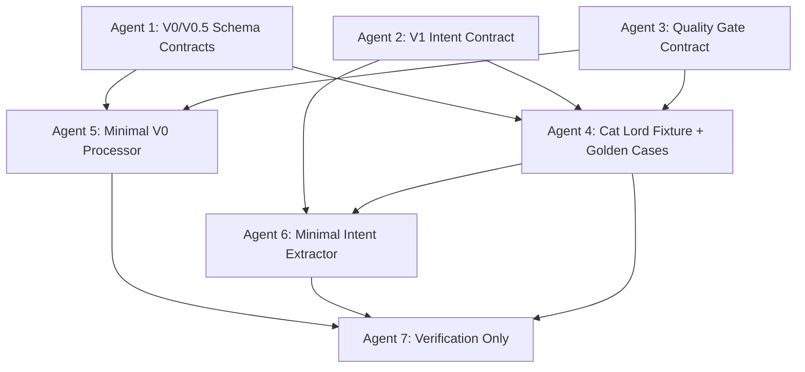

# Finer Multi-Agent Execution Plan

> 目标: 将 `docs/ARCHITECTURE.md` 和 `docs/architecture-alignment-plan.md` 转成可并行执行、可追踪、可验收的 Agent 任务包。当前阶段不追求完整模型训练，优先打通“超长猫大人 KOL 内容 -> V0 标准化 -> V0.5 时间/质量/实体锚定 -> V1 投资意图”的严格试验链路。

## 1. 执行原则

1. 每个实现 Agent 必须只修改自己的文件范围。
2. 每个实现 Agent 必须新增或更新测试，不能只改业务代码。
3. 每个实现 Agent 必须在最终回复中列出:
   - 修改文件清单
   - 新增 schema/函数/接口清单
   - 运行过的命令
   - 未完成或有疑问的地方
4. 检查 Agent 不允许改代码，只允许读文件、跑命令、给出验收结论。
5. 所有新增数据结构都必须能 JSON 序列化、反序列化，并带 schema version。
6. 所有从 KOL 内容抽取出的结果必须保留证据链，不能只有模型结论。
7. 所有“完成”必须由测试、fixture 输出和文件差异共同确认，不能只凭 Agent 自述。

## 2. 当前优先级

### P0: 架构契约冻结

这是所有后续任务的前置项。没有稳定合约，后续 OCR、聊天切分、intent 抽取和回测都会反复返工。

交付物:
- V0 `ContentEnvelope` / `ContentBlock`
- V0.5 `QualityCard` / `TemporalAnchor` / `EvidenceSpan` / `EntityAnchor`
- V1 `NormalizedInvestmentIntent`
- 统一 fixture: 超长猫大人 KOL 样本
- 质量门控规则
- 最小端到端测试

### P1: 猫大人样本试验链路

目标不是一次性处理全部 KOL，而是用一个复杂、真实、图片优先、信息密度高的样本压测架构边界。

验收标准:
- 图片策略文本可以被表示为多个 `ContentBlock`
- 每个 block 有质量卡
- 每个投资相关判断有 evidence span
- 相对时间和绝对时间都保留，并给出置信度
- 能抽出 V1 intent，但不强行生成仓位
- 模糊样本保留并标注 ambiguity

### P2: Policy 和 TradeAction 映射

在 P0/P1 合格之前不要提前做重。否则会把不稳定的自然语言解析错误固化到回测。

## 3. 并行执行结构



推荐先并行启动 Agent 1、2、3。它们都完成后，再启动 Agent 4、5、6。最后启动 Agent 7。

## 4. 工作区建议

如果要多个 Codex/Agent 并行执行，建议使用 git worktree，避免互相覆盖。

```bash
cd /Users/zhouhongyuan/Desktop/finer
git status --short

# 建议先提交或至少确认当前 docs 变更是基线，否则 worktree 不会自动包含未提交文档。
git worktree add ../finer-agent-v0-contracts -b codex/v14-v0-contracts
git worktree add ../finer-agent-v1-intent -b codex/v14-v1-intent
git worktree add ../finer-agent-quality -b codex/v14-quality-gates
git worktree add ../finer-agent-fixtures -b codex/v14-catlord-fixtures
git worktree add ../finer-agent-v0-processor -b codex/v14-v0-processor
git worktree add ../finer-agent-intent-extractor -b codex/v14-intent-extractor
git worktree add ../finer-agent-verify -b codex/v14-verify
```

如果不使用 worktree，则必须串行执行，不能让多个 Agent 同时修改同一个工作目录。

## 5. Agent 1: V0/V0.5 Schema Contracts

### 任务目标

新增 V0 和 V0.5 的 Pydantic schema，建立统一内容标准化层。该 Agent 不实现 OCR、不实现 LLM 调用、不实现 intent 抽取。

### 允许修改

- `src/finer/schemas/content_envelope.py`
- `src/finer/schemas/quality.py`
- `src/finer/schemas/temporal.py`
- `src/finer/schemas/evidence.py`
- `src/finer/schemas/entity_anchor.py`
- `src/finer/schemas/__init__.py`
- `tests/test_content_envelope_schema.py`
- `tests/test_quality_temporal_evidence_schema.py`

### 禁止修改

- `src/finer/extraction/**`
- `src/finer/parsing/**`
- `src/finer/pipeline/**`
- `src/finer/schemas/trade_action.py`
- 前端文件

### 文件合约

#### `ContentEnvelope`

必须字段:
- `envelope_id: str`
- `schema_version: str`
- `source_type: Literal["image", "chat", "feishu_doc", "pdf", "audio_transcript", "video_transcript", "text"]`
- `source_uri: str | None`
- `source_title: str | None`
- `creator_id: str | None`
- `creator_name: str | None`
- `published_at: datetime | None`
- `ingested_at: datetime`
- `blocks: list[ContentBlock]`
- `quality_card: QualityCard`
- `temporal_anchors: list[TemporalAnchor]`
- `entity_anchors: list[EntityAnchor]`
- `metadata: dict[str, Any]`

#### `ContentBlock`

必须字段:
- `block_id: str`
- `block_type: Literal["paragraph", "heading", "table", "chart", "image_region", "chat_message", "transcript_segment", "list", "unknown"]`
- `text: str`
- `order: int`
- `parent_block_id: str | None`
- `page_index: int | None`
- `bbox: list[float] | None`
- `speaker: str | None`
- `start_time_sec: float | None`
- `end_time_sec: float | None`
- `quality_card: QualityCard`
- `evidence_spans: list[EvidenceSpan]`
- `metadata: dict[str, Any]`

#### `QualityCard`

六维主卡:
- `readability_score`
- `semantic_completeness_score`
- `financial_relevance_score`
- `entity_resolution_score`
- `temporal_resolution_score`
- `evidence_traceability_score`

每个分数范围必须是 `[0.0, 1.0]`。

必须派生:
- `overall_score`
- `gate_status: Literal["pass", "review", "reject"]`
- `gate_reasons: list[str]`

#### `TemporalAnchor`

必须支持四类时间:
- `published_at`
- `mentioned_at`
- `resolved_at`
- `effective_trade_at`

必须字段:
- `anchor_id`
- `anchor_type`
- `raw_text`
- `resolved_time`
- `confidence`
- `resolution_strategy`
- `evidence_span_id`

#### `EvidenceSpan`

必须字段:
- `evidence_span_id`
- `block_id`
- `char_start`
- `char_end`
- `text`
- `confidence`

### 验收命令

```bash
cd /Users/zhouhongyuan/Desktop/finer
pytest tests/test_content_envelope_schema.py tests/test_quality_temporal_evidence_schema.py -q
python -m compileall src/finer/schemas
```

### Agent 执行提示词

```text
你负责实现 Finer 的 V0/V0.5 schema contracts。只允许修改文档中列出的 schema 文件和测试文件。不要实现 OCR、LLM、pipeline 或 TradeAction 映射。请先阅读 docs/ARCHITECTURE.md 的 4.x 数据模型部分和 docs/agent-execution-plan.md 的 Agent 1 文件合约，然后实现 Pydantic 模型和单元测试。完成后运行指定 pytest 和 compileall，并在最终回复列出修改文件、模型字段、命令输出摘要和风险。
```

## 6. Agent 2: V1 Intent Contract

### 任务目标

新增 `NormalizedInvestmentIntent`，明确它是 TradeAction 前置层，不直接表达仓位。

### 允许修改

- `src/finer/schemas/investment_intent.py`
- `src/finer/schemas/__init__.py`
- `tests/test_investment_intent_schema.py`

### 禁止修改

- `src/finer/schemas/trade_action.py`
- `src/finer/extraction/trade_action_extractor.py`
- `src/finer/backtest/**`
- 前端文件

### 文件合约

`NormalizedInvestmentIntent` 必须字段:
- `intent_id: str`
- `schema_version: str`
- `envelope_id: str`
- `block_ids: list[str]`
- `creator_id: str | None`
- `target_type: Literal["stock", "sector", "index", "macro", "commodity", "crypto", "unknown"]`
- `target_name: str`
- `target_symbol: str | None`
- `market: str | None`
- `direction: Literal["bullish", "bearish", "neutral", "mixed", "unknown"]`
- `actionability: Literal["opinion", "watch", "explicit_action", "review_required"]`
- `position_delta_hint: Literal["open", "add", "reduce", "hold", "exit", "none", "unknown"]`
- `conviction: float`
- `sentiment_score: float | None`
- `risk_preference_hint: Literal["aggressive", "balanced", "conservative", "unknown"]`
- `time_horizon_hint: Literal["intraday", "short_term", "medium_term", "long_term", "unknown"]`
- `temporal_anchor_ids: list[str]`
- `evidence_span_ids: list[str]`
- `ambiguity_flags: list[str]`
- `confidence: float`
- `metadata: dict[str, Any]`

必须明确区分:
- “我看好宁德时代” = bullish + opinion/watch
- “我加仓宁德时代” = bullish + explicit_action + add
- “继续持有腾讯” = bullish 或 neutral + explicit_action + hold，按上下文置信度决定

### 验收命令

```bash
cd /Users/zhouhongyuan/Desktop/finer
pytest tests/test_investment_intent_schema.py -q
python -m compileall src/finer/schemas
```

### Agent 执行提示词

```text
你负责实现 Finer 的 V1 NormalizedInvestmentIntent schema。只允许修改 investment_intent schema、schemas __init__ 和对应测试。不要改 TradeAction，不要实现 extractor。请保证 schema 能表达 direction/actionability/position_delta_hint/conviction 四个主轴，以及 sentiment_score 作为附加维度。完成后运行指定测试和 compileall。
```

## 7. Agent 3: Quality Gate Contract

### 任务目标

建立任务导向的质量门控规则，专门判断一个内容块是否足以进入 V1 intent 抽取。

### 允许修改

- `src/finer/services/quality_gate.py`
- `tests/test_quality_gate.py`
- `docs/specs/quality-gate.md`

### 依赖

依赖 Agent 1 的 `QualityCard` schema。如果并行执行，先用文档合约实现，合并时对齐字段名。

### 文件合约

新增:
- `QualityGateDecision`
- `QualityGatePolicy`
- `evaluate_quality_card(card: QualityCard, policy: QualityGatePolicy | None = None) -> QualityGateDecision`
- `evaluate_envelope_quality(envelope: ContentEnvelope, policy: QualityGatePolicy | None = None) -> QualityGateDecision`

默认门控:
- `pass`: overall >= 0.75 且 financial_relevance >= 0.6 且 evidence_traceability >= 0.6
- `review`: overall >= 0.45 或关键维度中任一项缺失/低置信
- `reject`: overall < 0.45 且 financial_relevance < 0.3

必须输出:
- `status`
- `score`
- `reasons`
- `recommended_next_step: Literal["extract_intent", "manual_review", "reprocess_source", "drop"]`

### 猫大人图片策略示例规则

对于图片策略，不能因为 OCR 局部乱码直接 reject。应按 block 评估:
- 大段策略正文 readable，金融相关高，进入 V1
- 表格或图表 OCR 低置信但位置清楚，进入 review
- 无法识别的社交媒体 UI 噪声，drop 或 low priority

### 验收命令

```bash
cd /Users/zhouhongyuan/Desktop/finer
pytest tests/test_quality_gate.py -q
python -m compileall src/finer/services
```

### Agent 执行提示词

```text
你负责实现 Finer 的 Quality Gate Contract。只允许修改 quality_gate service、测试和 docs/specs/quality-gate.md。你的目标是用确定性规则判断 ContentEnvelope/ContentBlock 的质量门控状态，不调用 API，不实现 OCR。请重点覆盖图片策略、长聊天、音频转录三类质量差异。完成后运行指定测试和 compileall。
```

## 8. Agent 4: Cat Lord Fixture + Golden Cases

### 任务目标

建立“超长猫大人 KOL 内容”的最小可复现实验 fixture。该 Agent 负责数据样本和黄金期望，不实现业务逻辑。

### 允许修改

- `tests/fixtures/kol/cat_lord_strategy_image_2026_04_26.md`
- `tests/fixtures/kol/cat_lord_strategy_image_2026_04_26.expected_v0.json`
- `tests/fixtures/kol/cat_lord_strategy_image_2026_04_26.expected_v1.json`
- `tests/test_cat_lord_fixture_contract.py`
- `docs/specs/cat-lord-golden-case.md`

### 禁止修改

- `src/finer/**`

### Fixture 合约

`cat_lord_strategy_image_2026_04_26.md` 必须包含:
- 来源说明: 图片策略内容
- KOL: 猫大人
- 发布时间: 从原图或上下文提取；无法确认时写 `unknown` 并说明
- OCR 文本: 只能使用真实 OCR 或人工转写，不允许由模型补写缺失内容
- 明显无法识别区域: 用 `[OCR_UNREADABLE]`
- 表格/图表: 用 Markdown 表或 `[TABLE_REGION]` / `[CHART_REGION]` 占位，并保留图片区域说明

`expected_v0.json` 必须验证:
- 至少 8 个 `ContentBlock`
- 至少包含 `paragraph`, `list`, `image_region`, `table` 或 `chart` 中的 3 类
- 每个 block 有 `quality_card`
- 与投资有关的 block 有 `evidence_spans`

`expected_v1.json` 必须验证:
- 至少 5 条 intent
- 必须覆盖:
  - 指数或市场环境判断
  - 行业/板块判断
  - 个股判断
  - 风险提示或不确定性
  - 图片中表格/图表相关证据
- 不允许包含仓位百分比，除非原文明确给出

### 验收命令

```bash
cd /Users/zhouhongyuan/Desktop/finer
pytest tests/test_cat_lord_fixture_contract.py -q
python -m json.tool tests/fixtures/kol/cat_lord_strategy_image_2026_04_26.expected_v0.json >/tmp/cat_v0.json
python -m json.tool tests/fixtures/kol/cat_lord_strategy_image_2026_04_26.expected_v1.json >/tmp/cat_v1.json
```

### Agent 执行提示词

```text
你负责建立猫大人超长图片策略的 fixture 和 golden cases。只允许修改 tests/fixtures/kol、对应 fixture 测试和 docs/specs/cat-lord-golden-case.md。不要改 src/finer。OCR 文本必须来自用户提供样本或真实转写，不允许补写。无法识别处用 [OCR_UNREADABLE]。expected_v0/v1 是黄金期望，用于后续实现 Agent 对齐。完成后运行指定测试和 json.tool。
```

## 9. Agent 5: Minimal V0 Processor

### 任务目标

实现一个最小 V0 标准化处理器，把文本化后的图片策略、聊天记录、音频转录稿统一转成 `ContentEnvelope`。

### 允许修改

- `src/finer/parsing/content_standardizer.py`
- `src/finer/parsing/__init__.py`
- `tests/test_content_standardizer.py`

### 依赖

依赖 Agent 1 和 Agent 3。

### 文件合约

新增:
- `standardize_markdown_source(...) -> ContentEnvelope`
- `standardize_text_source(...) -> ContentEnvelope`

最小能力:
- 按标题、列表、段落、表格占位符、图表占位符拆分 block
- 保留 block order
- 生成 evidence span
- 生成默认 quality card
- 保留 `creator_id`, `creator_name`, `published_at`, `source_type`

不得做:
- 不调用 LLM
- 不做复杂自然语言交易意图判断
- 不映射 TradeAction

### 验收命令

```bash
cd /Users/zhouhongyuan/Desktop/finer
pytest tests/test_content_standardizer.py tests/test_cat_lord_fixture_contract.py -q
python -m compileall src/finer/parsing
```

### Agent 执行提示词

```text
你负责实现 Minimal V0 Processor。只允许修改 content_standardizer、parsing __init__ 和对应测试。目标是把文本化后的图片策略/聊天/转录稿转换为 ContentEnvelope，不做 LLM 推理，不做 TradeAction。请用猫大人 fixture 验证输出 block 类型、顺序、quality_card 和 evidence_span。完成后运行指定测试和 compileall。
```

## 10. Agent 6: Minimal Intent Extractor

### 任务目标

实现规则优先的最小 V1 intent extractor，用于验证架构，不追求最终准确率。

### 允许修改

- `src/finer/extraction/intent_extractor.py`
- `src/finer/extraction/__init__.py`
- `tests/test_intent_extractor.py`

### 依赖

依赖 Agent 1、Agent 2、Agent 4。

### 文件合约

新增:
- `IntentExtractionResult`
- `extract_intents_from_envelope(envelope: ContentEnvelope) -> IntentExtractionResult`

最小规则:
- “看好/受益/机会/加仓/抄底/持有” -> bullish 候选
- “看空/减仓/退出/不及预期/风险/回避” -> bearish 或 risk 候选
- “加仓/抄底/买入” -> `actionability=explicit_action`, `position_delta_hint=add/open`
- “持有/继续拿” -> `actionability=explicit_action`, `position_delta_hint=hold`
- “看好/关注” -> `actionability=opinion/watch`, `position_delta_hint=none`
- 找不到明确实体时保留 `target_name="unknown"` 并加 ambiguity flag

必须:
- 每条 intent 至少绑定一个 evidence span
- sentiment_score 只能作为辅助，不可覆盖 explicit action
- 不生成仓位比例
- 不写入 TradeAction

### 验收命令

```bash
cd /Users/zhouhongyuan/Desktop/finer
pytest tests/test_intent_extractor.py -q
python -m compileall src/finer/extraction
```

### Agent 执行提示词

```text
你负责实现 Minimal Intent Extractor。只允许修改 intent_extractor、extraction __init__ 和对应测试。目标是从 ContentEnvelope 生成 NormalizedInvestmentIntent，用规则优先验证架构边界，不调用外部 API，不生成 TradeAction，不生成仓位。请用猫大人 fixture 的 expected_v1 进行最小黄金样本验证。完成后运行指定测试和 compileall。
```

## 11. Agent 7: Verification Only

### 任务目标

独立检查所有 Agent 是否真的完成。该 Agent 不允许修改任何文件。

### 只读范围

允许读取全仓库。

### 禁止操作

- 不允许 `apply_patch`
- 不允许写文件
- 不允许格式化代码
- 不允许“顺手修复”
- 不允许只看最终回复就判定完成

### 检查命令

```bash
cd /Users/zhouhongyuan/Desktop/finer
git status --short
git diff --name-only
pytest tests/test_content_envelope_schema.py tests/test_quality_temporal_evidence_schema.py tests/test_investment_intent_schema.py tests/test_quality_gate.py tests/test_cat_lord_fixture_contract.py tests/test_content_standardizer.py tests/test_intent_extractor.py -q
pytest -q
python -m compileall src/finer
python -m json.tool tests/fixtures/kol/cat_lord_strategy_image_2026_04_26.expected_v0.json >/tmp/cat_v0.verify.json
python -m json.tool tests/fixtures/kol/cat_lord_strategy_image_2026_04_26.expected_v1.json >/tmp/cat_v1.verify.json
```

### 强制检查清单

1. 文件边界检查:
   - Agent 是否修改了未授权文件
   - 是否误改了 `TradeAction`
   - 是否误改了前端或 pipeline

2. Schema 检查:
   - 所有新增模型是否有 `schema_version`
   - 时间字段是否区分发布、提及、解析、生效交易时间
   - `QualityCard` 是否有六维主卡
   - `NormalizedInvestmentIntent` 是否有四个主轴

3. 证据链检查:
   - intent 是否绑定 evidence span
   - evidence span 是否能回到 block
   - block 是否能回到 envelope/source

4. 猫大人样本检查:
   - 是否包含真实转写或明确 `[OCR_UNREADABLE]`
   - 是否至少 8 个 V0 block
   - 是否至少 5 条 V1 intent
   - 是否覆盖市场、板块、个股、风险、图表/表格证据

5. 反误判检查:
   - 不接受“测试没跑但应该可以”
   - 不接受“API key 缺失所以跳过核心测试”
   - 不接受“模型输出看起来合理”作为唯一依据
   - 不接受没有 fixture 的 extractor
   - 不接受没有 evidence 的 intent

### 验收结论格式

检查 Agent 最终必须用这个格式回复:

```text
结论: PASS / PARTIAL / FAIL

已验证:
- ...

阻塞问题:
- [P0] ...

非阻塞问题:
- [P1] ...

命令结果:
- pytest targeted: ...
- pytest full: ...
- compileall: ...
- json validation: ...

文件边界:
- 合规/不合规，具体文件...

是否允许进入下一阶段:
- 是/否
```

### Agent 执行提示词

```text
你是 Verification Only Agent。你只负责验收，不允许修改任何文件。请严格执行 docs/agent-execution-plan.md 的 Agent 7 检查命令和强制检查清单。不要相信实现 Agent 的自述，必须用 git diff、pytest、compileall、fixture JSON 和源码检查确认。最终按指定格式给出 PASS/PARTIAL/FAIL。
```

## 12. 首轮推荐任务顺序

### Round 1: 合约并行

并行执行:
- Agent 1: V0/V0.5 Schema Contracts
- Agent 2: V1 Intent Contract
- Agent 3: Quality Gate Contract

合并前检查:

```bash
pytest tests/test_content_envelope_schema.py tests/test_quality_temporal_evidence_schema.py tests/test_investment_intent_schema.py tests/test_quality_gate.py -q
```

### Round 2: 样本和最小链路并行

并行执行:
- Agent 4: Cat Lord Fixture + Golden Cases
- Agent 5: Minimal V0 Processor
- Agent 6: Minimal Intent Extractor

注意: Agent 5/6 若依赖 Agent 4 的 fixture，可以先写自己的合成测试，合并后再对齐猫大人 fixture。

合并前检查:

```bash
pytest tests/test_cat_lord_fixture_contract.py tests/test_content_standardizer.py tests/test_intent_extractor.py -q
```

### Round 3: 独立验收

执行 Agent 7。只有 Agent 7 给出 PASS，才进入 Policy Mapping 和 TradeAction 映射。

## 13. 下一阶段不要提前做的事

以下任务重要，但不是当前首轮:

- 不训练自有模型
- 不做完整回测收益归因
- 不优化 KOL 评分算法
- 不做多 KOL 分歧图谱
- 不接入复杂 persona policy
- 不做前端大改

原因: 这些任务依赖 V0/V1 的稳定语义合约。现在提前做，容易把源数据清洗和意图抽取的错误传递到后续模型与回测。

## 14. 当前阶段完成定义

当前阶段完成，不等于 Finer 完成。只表示:

1. 复杂 KOL 内容可以进入统一 V0 容器。
2. 图片策略作为一等输入被拆成可追踪 block。
3. 每个 block 有质量分和门控状态。
4. 时间锚定能表达相对时间、绝对时间和置信度。
5. V1 intent 能表达方向、可操作性、仓位变化暗示和信念强度。
6. 猫大人样本可以作为回归测试，防止后续 Agent 自说自话。
7. TradeAction 仍保持为 V3，不被当前任务提前污染。
