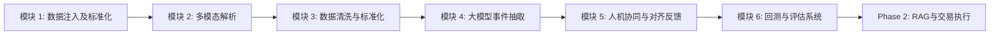
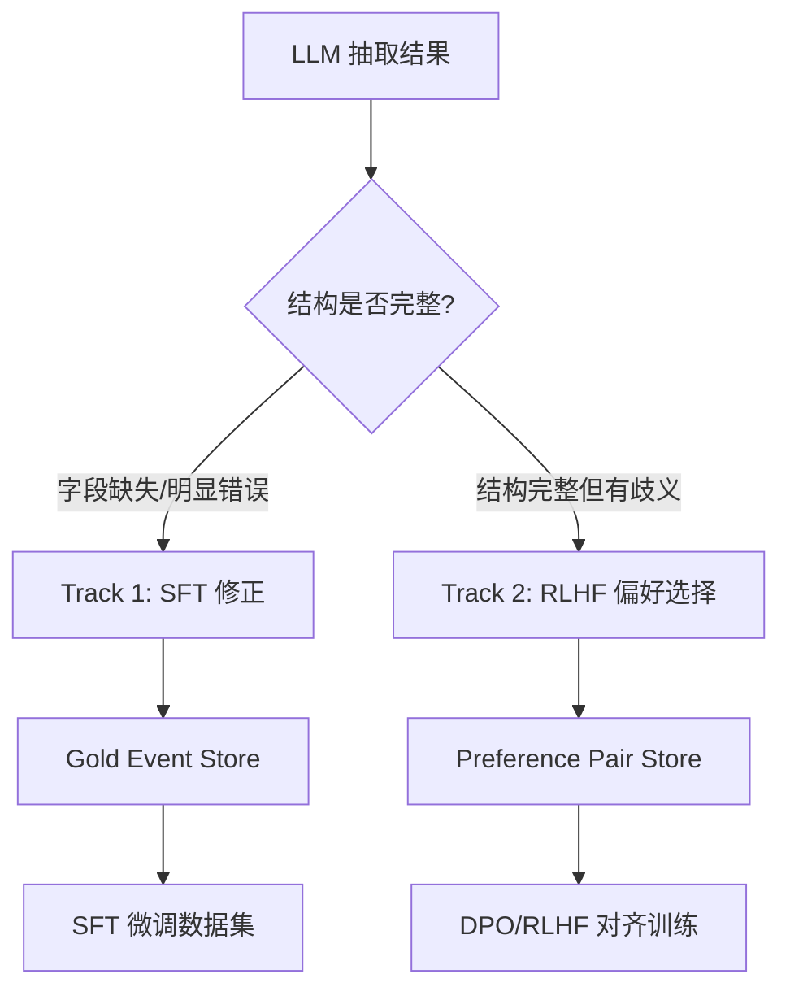

# finer - 投资研究自动化系统架构

## 核心目标 (Goal)

构建一个高度自动化的端到端数据流水线，将网络创作者（KOL）的投资观点、研究长图、直播录像及文章，转化为高度结构化的“投资事件”（Investment Events），以便进行严格的客观评估与量化回测。

目前一阶段的核心关注对象为 `trader韭`。

---

## 一、 系统架构概览 (Architecture Overview)

本系统采用高度模块化的设计，将整个生命周期分解为 6 个相互解耦且易于扩展的核心模块。这种架构既允许部分人工的早期介入（HitL - Human-in-the-Loop），又能无缝升级与连接至全自动的量化系统中。



---

## 二、 核心模块详解与技术选型分析

### 模块 1: 数据注入及标准化 (Source Ingestion & Normalization)

**模块职责**：
- 抓取多平台的内容（Bilibili 视频/弹幕/评论、微信公众号长图、播客音频）。
- 为每个独特内容创建唯一且稳定的标识符 (Content ID)。
- 统一归档原始媒体流与基础元数据（创作者、抓取时间、平台标签）。

**技术推演与选项分析**：
- **选项 A (轻量级命令行抓取)：** `yt-dlp` / `BBDown`。优势在于极高的响应速度与开箱即用的音视频提取能力；劣势在于对网页DOM变化的结构性数据抓取能力弱，容易遭遇硬性的 API 反爬限制。
- **选项 B (高并发爬虫框架)：** `Scrapy`。优势在于并发度高；劣势是无法应对动态渲染与强滑块验证的现代平台（如小红书、雪球、B站Web端）。
- **选项 C (自动化无头浏览器方案)：** `Playwright` 结合 `Stealth` 插件。优势为能完全规避反爬风险(WAF)，获取渲染后最真实的页面元素；劣势在于资源消耗大、运行极慢。

**🌟 最适化方案推荐**：
采用 **混合架构（Hybrid Ingestion）**：
- 对于**结构化及音视频下载**（B站），依然使用 **`BBDown` / `yt-dlp`** 作为底层执行器。
- 对于**反爬严厉的图文内容及雪球等社区讨论**，接入 **`Playwright` 指纹模拟器**进行降速仿真采集。

### 模块 2: 多模态解析 (Document / Audio Parsing)

**模块职责**：
- 提取非结构化图像、视音频中的隐式信息，转化为结构化数据块。
- **图像路径**：高保真 OCR 识别长图，不仅提取文本，还需要维持原有的文本框顺位与层级（Heading、List）。
- **音频路径**：音频转写的同时完成讲话者日记化（Diarization）。

**技术推演与选项分析**：
- **选项 A (组合模型)：** `PaddleOCR` + `WhisperX` + `pyannote-audio`。优势在于能精细控制中文字符识别边界以及音频转写，对于中文特定场景效果好；劣势是自行组织段落结构（特别是多栏排版）的代码维护成本激增。
- **选项 B (广义非结构化解析器)：** `Unstructured.io`。优势在于API丰富，覆盖各种文档；劣势是框架臃肿，对于复杂金融排版的解析效果时常失效。
- **选项 C (先进文档解析器)：** `MinerU` / `Docling` / `Got-OCR`。这类专门针对视觉解析大模型的出现，优势在于它们能**保持物理排版（逻辑连贯的 Markdown 树）**，对金融研报和图文有着极佳的结构化还原能力。

**🌟 最适化方案推荐**：
- **图文视觉通道**：全面接入云端视觉大模型（如 `Qwen-VL-Max`）替代繁重的本地大模型部署。能够以超越原生 OCR 几代的水平将金融长图转化为高质量包含图表信息的 Markdown（完整保留原本极其复杂的十字排版逻辑）。
- **音频处理通道**：主路线采用 `Paraformer`（通义听悟）等 ASR 引擎获取时间戳级转录。
- **回退降级策略 (Fallback Strategy)**：由于云端长音频转录常需 OSS 对象储存直接支持，在仅有本地算力或文件过大的环境下，系统具备自动侦测并挂载同名转录文稿（如 `.mp3.pdf`）并无缝切片的降级流转能力，杜绝管道堵塞报错。
- **黑话词典初始化 (Slang Dictionary Init)**：直连用户维护的 `词语个人理解（持续更新）.xlsx`，作为系统的第一层语义对齐库。

### 模块 3: 数据清洗与标准化 (Data Cleaning & Normalization) [标注焦点]

**模块职责**：
对于模块 2 吐出的大量 JSON 及 Markdown 进行结构去噪、无用OCR碎片的剔除、以及针对 JSON `segment` 格式的强类型校验，作为喂给 LLM 抽取的纯净“输入垫”。

**技术推演与选项分析**：
- **选项 A (原生 Python 脚本)：** 优势：轻量、无心智负担。劣势：难以扩展。若处理包含海量无意义停用词或OCR乱码的超长记录去重，代码将变得极为面条化 (Spaghetti Code)，且容易导致 Out-of-Memory (OOM)。
- **选项 B (ETL工具链)：** `dlt` (data load tool)。优势：数据流无缝对接数据库。劣势：它主要是为数据入库做 schema matching 的工具，缺乏 AI 领域所需的自然语言级算子过滤。
- **选项 C (流式 AI 数据处理框架)：** `Data-Juicer`。优势：提供上百种即插即用的 AI 数据去噪算子（如：文档重复率检测、短句/特殊符号剔除、语言识别率过滤），非常适合大模型前置的数据提纯。并且其模块化 pipeline 易于扩展。

**🌟 最适化方案推荐**：
采用 **`Data-Juicer` + `Pydantic`** 联合校验：
1. 先利用 **`Data-Juicer`** 过滤 OCR 阶段可能抽取出的大量乱码字符、重复识别文本模块以及无意义的广告片段。
2. 使用 **`Pydantic`** 编写严格的 `Segment Schema` 解析规则，确保数据强耦合，字段（如 `content_id`, `text`, `source_modality`）若有缺失在运行时即刻拦截。
3. **多层级结构上下文与情绪张力曲线 (Contextual Hierarchy & Sentiment Curve)**：
   - **全局层 (Global)**：通过 LLM 生成全文执行摘要（`overall_summary`），注入 `ContentRecord`。
   - **局部层 (Local)**：为每个 Segment 自动概括上文/下文逻辑（`prev/next_context_summary`），通过滑动窗口 LLM 处理。
   - **极化情绪层**：运用正则表达式进行“纯净逐句切割”，避免被逗号碎片化，捕捉分析师转折性情绪信号。

### 模块 4: 大模型事件抽取 (Event Extraction)

**模块职责**：
- 从经过清洗的文本段中，进行逻辑提炼与研判。
- 判断市场板块、相关个股、预测方向（多/空）、预测期限。
- **不可投资评论**识别与剥离。
- ⚡ **核心升级**：将单一 `direction` 字段升级为 **多步操作意图链 (Action Chain)**，支持条件触发、多步复合操作和衍生品策略映射。

**技术推演与选项分析**：
- **选项 A (大型 Prompt + 原生 Request)：** 优势：灵活。劣势：LLM 以 JSON 形式反馈提取内容时时常发生幻觉或少漏字段，引发反序列化解析错误。
- **选项 B (重型 RAG 框架)：** `LangChain` 或 `LlamaIndex`。优势：周边生态繁荣。劣势：对于核心为批处理事件“提取”（Extraction）逻辑而非问答（QA）的情境显得过于臃肿黑盒。
- **选项 C (基于类型的输出强制器)：** `Instructor` / `Marvin` 或 `DSPy`。`Instructor` 的优势在于它直接给 LLM 绑定了一个 Pydantic Model，在最底层通过 OpenAI/Anthropic/开源模型的 function-calling 强力限制输出格式。而 `DSPy` 能实现自动提词优化。

**🌟 最适化方案推荐**：
系统核心抽取层应基于 **`Instructor` (搭配 Pydantic)**。我们直接定义 `Event` 类体系，借助 `Instructor` + 主流 VLM/LLM (如 GPT-4o 或 DeepSeek) 进行高强度约束抽取，绝不向结构化输出字段不全的错误妥协。

#### 4.1 TradingAction 操作链设计 (核心架构升级)

**问题诊断**：当前 `Event` 的 `direction` 字段（`bullish/bearish/neutral/watchlist/risk_warning`）过于扁平。以 "短期看空520的腾讯，目标在480到500建仓" 为例，这句话的真实含义是一个**两步复合操作**，但被错误压缩为单一 `direction`——信息损失是毁灭性的。

同一句话甚至可以映射到完全不同的衍生品策略：
- 解读 A（现货逻辑）：先做空，等到 480 后平仓并买入
- 解读 B（期权逻辑）：sell 480 的 put（收取权利金，有义务在 480 接货）
- 解读 C（价差策略）：buy 520 put + sell 480 put（熊市价差）

**解决方案**：引入 `TradingAction` 子模型，将 Event 拆解为"观点层"和"操作意图层"：

```
┌──────────────────────────────────────────────────────────┐
│  Event (观点层 - 保留现有字段)                            │
│  ├── direction: bearish_then_bullish (复合方向)           │
│  ├── evidence_text: "短期看空520...480到500建仓"          │
│  │                                                        │
│  └── actions: [  ← 新增：操作意图链                       │
│        {                                                  │
│          action_type: "short" | "long" | "sell_put" | ... │
│          trigger_condition: "price <= 520"                │
│          target_price_range: [480, 500]                   │
│          instrument: "stock" | "option" | "etf"           │
│          sequence_order: 1                                │
│        },                                                 │
│        {                                                  │
│          action_type: "long"                              │
│          trigger_condition: "price in [480, 500]"         │
│          instrument: "stock"                              │
│          sequence_order: 2                                │
│        }                                                  │
│      ]                                                    │
└──────────────────────────────────────────────────────────┘
```

**TradingAction Schema 定义** (JSON Schema 风格)：

```json
{
  "actions": {
    "type": "array",
    "description": "从原文推断的有序操作意图链",
    "items": {
      "type": "object",
      "required": ["action_type", "sequence_order"],
      "properties": {
        "action_type": {
          "type": "string",
          "enum": [
            "long", "short", "close_long", "close_short",
            "accumulate", "reduce",
            "buy_call", "sell_call", "buy_put", "sell_put",
            "hold", "watch"
          ]
        },
        "instrument_type": {
          "type": "string",
          "enum": ["stock", "etf", "index_future", "option", "unspecified"]
        },
        "trigger_condition": {
          "type": ["string", "null"],
          "description": "自然语言描述的触发条件，如 price <= 520"
        },
        "target_price_low": { "type": ["number", "null"] },
        "target_price_high": { "type": ["number", "null"] },
        "stop_loss": { "type": ["number", "null"] },
        "sequence_order": { "type": "integer" },
        "confidence": { "type": ["number", "null"] }
      }
    }
  }
}
```

**Pydantic 实现参考**：

```python
class TradingAction(BaseModel):
    action_type: Literal["long", "short", "close_short", "sell_put", "watch", "hold"]
    instrument_type: Literal["stock", "option", "etf", "unspecified"]
    trigger_condition: str | None = None
    target_price_low: float | None = None
    target_price_high: float | None = None
    sequence_order: int
    confidence: float | None = None

class EventWithActions(BaseModel):
    evidence_text: str
    direction: str
    actions: list[TradingAction]
```

#### 4.2 操作意图解释器 (Action Interpreter)

在 `slang.py` 的黑话翻译之外，增加专门的**操作意图解释器**模块 (`src/finer/extraction/action_interpreter.py`)，将自然语言操作意图映射到标准化的 `TradingAction` 序列：

| 原文（自然语言） | 解析出的操作链 |
|:---|:---|
| "短期看空到480再建仓" | `[short → close_short@480 → long@480-500]` |
| "sell 480的put" | `[sell_put(strike=480)]` |
| "这个位置可以轻仓先上车" | `[long(position_size=small)]` |
| "破了240就跑" | `[close_long(trigger=price<240, stop_loss=240)]` |
| "这里先不急 等一个确认信号" | `[watch]` |

此映射器应为**可插拔设计**——Phase 1 基于规则 + Few-shot Prompt 模板实现，Phase 2 用 RLHF 微调的专用小模型替代。

#### 4.3 结构化输出保障：三阶段技术栈

| 阶段 | 工具 | 原理 | 适用性 |
|:---|:---|:---|:---|
| Phase 1 (当前) | **Instructor + Pydantic** | 后生成 + 自动修复重试，支持所有 API | ⭐ 首选，零迁移成本 |
| Phase 2 (本地推理) | **Outlines** | 有限状态机约束解码，数学保证 100% 合规 | 仅限本地模型 |
| Phase 3 (大规模生产) | **SGLang** | 高性能推理引擎 + 原生约束 | 吞吐量最高 |

#### 4.4 开源金融模型 Action Chain 能力对比

> 核心发现：目前没有任何一个开源项目完美解决了"从 KOL 口语化文本 → 多步条件操作链"这一端到端问题。这恰恰是 finer 项目的独特价值区间。

| 项目 | 自然语言理解 | Action 复杂度 | 条件触发 | 多步操作链 | 可解释性 | RLHF | 中文支持 |
|:---|:---|:---|:---|:---|:---|:---|:---|
| **FinGPT** | ✅ | 🔴 扁平 (buy/sell/hold) | ❌ | ❌ | ⚠️ | ✅ LoRA | ⚠️ |
| **FinRL** | ❌ | ✅ 连续仓位 [-1,1] | 隐式 | ❌ | ❌ | ❌ | N/A |
| **TradingAgents** | ✅ | ⚠️ 单一决策 | ✅ | 隐式 | ✅ | ❌ | ❌ |
| **PIXIU/FinMA** | ✅ | 🔴 分类 | ❌ | ❌ | N/A | ❌ | ⚠️ |
| **DISC-FinLLM** | ✅ | 🔴 实体列表 | ❌ | ❌ | ⚠️ | ❌ | ✅ |
| **轩辕 XuanYuan** | ✅ | ⚠️ CoT 推理 | ❌ | ❌ | ✅ CoT | ✅ | ✅ |
| **finer (目标)** | ✅ | ✅ 操作链 | ✅ | ✅ | ✅ | ✅ | ✅ |

**可借鉴的设计**：
- **TradingAgents**：多角色辩论架构 + 结构化 JSON 通信协议 → Phase 2 多 Agent 审查
- **FinGPT**：LoRA 轻量微调 + 定期重训练 → 黑话词典热更新
- **FinRL**：`action ∈ [-1, 1]` 仓位编码 → 回测引擎标准化
- **DISC-FinLLM**：Multi-Expert LoRA 切换 → 黑话 LoRA + 抽取 LoRA + 偏好 LoRA
- **轩辕 FinX1**：CoT 先推理后输出 → action_interpreter 的 Prompt 设计

### 模块 5: 人机协同与对齐反馈 (Human Review & RLHF) [标注焦点]

**模块职责**：
- 向分析师展示抽取的 `candidate event records` 以便修正错判的板块及方向标。
- 将人类分析师修改后的结果转化为高质量 “黄金标签” 数据（Gold Event Store）。
- 利用操作修改痕迹积累人类偏好（Preference Pairs），用于训练微调领域金融模型。

**技术推演与选项分析**：
- **选项 A (通用标注系统)：** `Label Studio`。优势：适用面最广，能看图、听音、标框。劣势：通用工具，在涉及大型语言模型微调任务中的比较纠错功能（如生成对齐 Reward Model 的 RLHF 格式）时表现比较吃力。
- **选项 B (高专业度自然语言标注系统)：** `Prodigy`。优势：主动学习循环。劣势：强绑定 spaCy，且为商业收费。
- **选项 C (大模型对齐专用平台)：** `Argilla`。优势：原生内置 SFT/RLHF 模板。劣势：对于多步操作意图链 (Action Chain) 的可视化和靶向证据高亮适配较差。
- **选项 D (自研研究员工作台)：** **Finer OS Dashboard**。优势：深度适配 canonical contract，支持实时证据高亮、操作链可视化编辑、以及分级的 `Save Draft / Approve` 逻辑。

**🌟 最适化方案推荐**：
采用 **Finer OS Dashboard (Next.js + FastAPI)**。
在我们的管线中，人工并不仅仅为了“修正数据库里的一条记录”，而是为了**不断“教育”底层抽取引擎**。Finer OS 提供了极致的标注体验，通过双向高亮绑定，确保每一个抽取出的 TradingAction 都有据可查，为后续的 SFT 和微调提供黄金质量的标注数据。

#### 5.1 双轨标注流 (Dual-Track Annotation)

当前 RLHF 设计停留在"修正字段值"这个 SFT 层面。实际需要两层截然不同的标注：

| 层次 | 目标 | 缺口 |
|:---|:---|:---|
| **层次 1：结构化数据校验** | 确认字段映射正确性（如 "腾讯" → `0700.HK`） | 需新增对 `actions` 链的逐步校验 |
| **层次 2：操作意图歧义消解** | 同一句话的多种操作解读——人类选最佳 | 此前完全缺失，这是真正的偏好数据源 |



**Track 1 (SFT 修正)**：在 Argilla 中标注"正确/错误"，并可编辑字段值。针对**明显的硬性错误**（如把"腾讯"识别成了"阿里"）。

**Track 2 (RLHF 偏好收集)**：对同一段 `evidence_text`，让模型生成 2~3 套不同的 `actions` 链（"做空再买入" vs "sell put" vs "熊市价差"），在 Argilla 中以并排对比的方式呈现，人类选择"哪个操作链最符合原文的真实意图"。此数据直接用于 DPO 训练。

#### 5.2 过程奖励模型 (PRM) 设计

**核心原理**（参考 OpenAI *Let's Verify Step by Step*）：传统 ORM 只在最终结果处打分，而 PRM 对推理链的**每一步独立打分**，可精确定位抽取链中哪步出了问题。

```text
投资事件抽取链的逐步评估:
  Step 1: 从原文中识别出 "腾讯"    → 这步对吗？
  Step 2: 判断市场为 "HK"           → 这步对吗？
  Step 3: 判断方向为 "先空后多"      → 这步对吗？
  Step 4: 触发条件 "价格=480-500"    → 这步对吗？
  Step 5: 操作类型 "short → long"    → 这步对吗？
  Step 6: 工具类型 "stock (非期权)"   → 这步对吗？
```

**PRM Schema**：

```python
class ProcessStepReward(BaseModel):
    step_name: str          # "entity_recognition", "direction_inference", etc.
    step_order: int
    correctness: Literal["correct", "partially_correct", "incorrect"]
    human_correction: str | None = None
    confidence: float = Field(..., ge=0, le=1)
```

#### 5.3 现代对齐训练方法（2025-2026 最佳实践）

经典 PPO-based RLHF 已被业界淘汰（需同时维护 4 个模型，训练不稳定）。finer 应采用现代替代方案：

| 方法 | 核心思想 | 需要配对数据？ | finer 适用场景 |
|:---|:---|:---|:---|
| **DPO** | 将 RL 转化为分类，直接优化 | ✅ 成对 | 有高质量配对数据时的最终精修 |
| **SimPO** | 去掉参考模型，用序列概率当奖励 | ✅ 成对 | 数据有噪声时更鲁棒 |
| **KTO** | 基于前景理论，只需二元反馈 | ❌ 仅需好/坏 | ⭐ 早期无配对数据阶段 |
| **GRPO** | DeepSeek-R1 核心，同一 Prompt 生成一组，组内互比 | ❌ 自生成 | ⭐ finer 最佳匹配 |
| **RLVR** | RL + 可验证奖励，用规则验证器打分 | ❌ 自生成 | 有客观验证标准时 |

**推荐训练流水线**：`SFT (500 条标注) → KTO/SimPO (偏好数据) → GRPO + RLVR (规则验证器自探索)`

> GRPO 是 finer 的最佳匹配：操作链提取具有**可验证性**（实体是否存在？价格是否出现在原文中？操作序列是否逻辑自洽？），可编写规则验证器自动打分。

#### 5.4 五层标注分类体系

完整标注标签分为 5 层 20 类，参考 DocFEE 和 CFinDEE 但针对 KOL 口语化场景定制：

| 层级 | 标签数 | 生成方式 | 内容 |
|:---|:---|:---|:---|
| **Layer 1: 元数据** | 4 | 完全自动 | timestamp, creator_id, source_platform, content_type |
| **Layer 2: 标的识别** | 5 | 80% 词典自动匹配 | entity_name, proxy_symbol, market, asset_class, related_symbols |
| **Layer 3: 观点方向** | 4 | 需人工判断（核心） | direction, conviction_intensity, time_horizon, catalyst_type |
| **Layer 4: 操作链** | 6 | 需人工设计（最有价值） | action_type, trigger_condition, target_price, instrument_type, sequence_order |
| **Layer 5: 上下文增强** | 1 | API 自动拉取 | fundamental_snapshot (PE/PB/ROE 等) |

> 人工实际只需标注 **Layer 3 + Layer 4 = 10 个字段**，其余 10 个可自动生成。

### 模块 6: 回测与评估系统 (Event Backtester)

**模块职责**：
- 将抽取生成的 `events`（特定时间段的看多/看空事件）锚定在投资标的 ETF/Index 代码上。
- 在时序上评价胜率与最大回撤，分析创作者的各类资产 Alpha 获取能力。

**技术推演与选项分析**：
- **选项 A (传统事件回溯)：** 手写 `Pandas` / `Polars` 分析。优势：灵活、快捷，适合处理一期较为简单直观的交易逻辑（比如“策略发布后10日的表现”）。
- **选项 B (完全量化平台)：** `Qlib` (Microsoft) 或者 `Backtrader`。优势：极为专业的因子建模、市场切片分析。劣势：要求非常僵硬的历史 K 线聚合格式与环境配置，在一期尚未跑通数据闭环时阻力过大。

**🌟 最适化方案推荐**：
**分阶段推进**：
Phase 1 使用构建在 **`Polars`** 上的轻量专属评测引擎，它在处理海量截面及滑动窗口收益判定时相比 Pandas 有着数量级的速度跃升。
Phase 2 当需要引入宏观多因子横向评测时，平滑接入对接至 **`Qlib`** 数据中心。

#### 6.1 三种回测模式（逐步递增复杂度）

当把单一的 `direction` 升级为带 `trigger_condition` 的多步操作链 `actions` 后，回测逻辑需要支持更复杂的交易状态流转：

| 模式 | 描述 | 适用场景 |
|:---|:---|:---|
| **Simple Window** | 发布后持有 N 天看回报 | 简单的"看多看空"事件 |
| **Trigger Entry** | 仅在价格触及 `target_price_range` 时才进场计时 | 条件触发型入场操作 |
| **Action Chain** | 模拟完整的 actions 序列，跟踪每步和止损盈亏 | 复杂多步策略 |

> Phase 1 先实现 Simple Window 和 Trigger Entry 即足够验证系统价值。Action Chain 可留到 Phase 2。

#### 6.2 七层评测指标金字塔

评测"自然语言 → trade action"的端到端效果需要多层指标，而不能只看最终的盈利。只有这样，PRM 才能发挥价值：

| 层级 | 评测指标 | 计算方式 / 含义 | 目标值 |
|:---|:---|:---|:---|
| **L7: 回测收益** | Backtest Alpha | 终极验证：操作链执行后 vs 基准的超额收益 | >0 |
| **L6: 人类偏好** | Win Rate | 人工评估：模型生成的 2 个不同结果，人类更倾向哪一个 | >50% |
| **L5: 操作链匹配** | Action Chain EM | 完整操作链（含顺序和条件）的精确匹配率 (Exact Match) | >60% |
| **L4: 个别字段 F1** | Slot-level F1 | 对价格/时间/触发条件等字段独立计算 P/R/F1 | >80% |
| **L3: 结构合法** | Parse Success Rate | 输出是否为能通过 Pydantic 校验的合法 JSON | >95% |
| **L2: 实体识别** | Entity F1 | 标的名称 + 标的代码 (proxy_symbol) 识别准确率 | >85% |
| **L1: 方向判断** | Direction Accuracy | 看多/看空/中立的基础属性判定准确率 | >90% |

---

## 三、 数据契约与层级存储结构 (Data Contracts & Storage)

### 3.1 核心流转结构
系统数据将始终被标准化包裹在以下三种层级 Schema（由 Pydantic 维护：`schemas/`）中流转：
1. **`Content Record`**： 囊括外部世界的一切输入（如一条含图与评论的推文）。
2. **`Segment Record`**： 清洗切片后的元数据块（如文中第 4 段讲述“消费复苏”的纯净文本）。
3. **`Event Record`**： 经过大模型提取的原子化操作建议与预期收益目标。

🚨 为了彻底消除 Schema 在 JSON 与 Python 间分叉的风险，**全体基准以 `schemas/*.py` 中的 Pydantic Schema 为唯一真相源 (SSOT)**，必须通过其 `model_json_schema()` 导出前端/外部所需的 json。

### 3.2 规范化代码目录树 (Project Structure Bond)
为了实现 AI Agent Vibe-Coding "**肌肉记忆般的文件定位能力**"，强约束以下模块必须放置在对应的 `src/finer/` 目录下：

```text
src/finer/
├── schemas/          # Pydantic models (唯一真相源)
│   ├── content.py
│   ├── segment.py
│   ├── event.py      # 含新的 TradingAction 子模型
│   └── research.py
├── ingestion/        # 【模块 1】
│   ├── bilibili.py
│   ├── wechat.py
│   └── manual.py
├── parsing/          # 【模块 2】
│   ├── ocr.py        # MinerU 适配器
│   ├── asr.py        # WhisperX 适配器
│   └── slang.py      # 黑话解析 (第 1 层静态词典)
├── cleaning/         # 【模块 3】
│   ├── juicer.py     # Data-Juicer pipeline
│   └── validators.py # Pydantic 前/后置校验
├── extraction/       # 【模块 4】
│   ├── extractor.py  # Instructor + LLM 抽取
│   └── action_interpreter.py  # 操作意图解释器
├── review/           # 【模块 5】
│   ├── argilla_sync.py
│   └── feedback_loop.py  # RLHF 数据回灌
├── backtesting/      # 【模块 6】
│   ├── engine.py
│   └── reporters.py
├── services/         # 横切关注点 (Logging, LLM calls)
│   ├── llm.py
│   └── converter.py
└── cli.py            # CLI Pipeline 入口
```

### 3.3 规范化持久层目录树 (Persistent Layer)
```text
data/
  raw/                   # 1. 未加工区域
    trader_ji/           # 按创作者分组
      weekly_strategy/
      daily_pre_post/
      bilibili_media/
  processed/             # 2. 清洗加工后区域
    blocks_md/           # MinerU 统一输出的 Markdown 降阶文件
    transcripts_json/    # WhisperX 时间戳序列
    clean_segments/      # Data-Juicer 清洗出的标准化投喂原料
  extracted/             # 3. 抽取结果区域
    candidate_events/    # 待校验的大模型生成输出
  review_store/          # 4. Argilla 数据仓库 (SFT / RLHF)
  metrics/               # 5. 回测产出报表及资产流水
```

---

## 四、 迭代边界规划

### Phase 1：验证与闭环 (当前目标)
- **范围限制**：针对指定的高质量样本 `trader韭`。
- **技术突破**：打通 `MinerU` 的高质量内容降维与 `Instructor` 的严格版式导出。
- **人力应用**：采用 `Argilla` 对齐审核大模型的抽取错误。
- **产出验证**：基于 `Polars` 运行基于绝对日期的事件驱动收益校验。

### Phase 2：智能升级与应用落地 (未来愿景)
- 泛化抓取，集成 `Playwright` 对多媒体阵地（包括强登录验证平台）的获取能力。
- 将由于 `Argilla` 收集的大量领域修正数据导入 `HuggingFace PEFT`，训练针对金融切片专门强化微调的小尺寸模型 (如 Llama-3-8B 财务特化版)。
- 对外提供 `RAG` 查询聊天界面（用户可提问： "过去半年 trader韭 最坚定的三大做多板块是什么？"）

---

## 五、 21 维大语言模型事件评估矩阵 (ArmoRM Assessment)

仅从收益结果（ORM）来对投资观点打分存在"幸存者偏差"。基于学术界最新的 ArmoRM 和 SteerLM 框架，项目定义了 **21 维事件评估矩阵**。这些维度通过多头奖励模型和人工标注进行评估，作为最终 RLHF 和交易执行的对齐偏好依据：

### 5.1 五组 21 维评估定义

| # | 评估维度 | 核心含义与来源 | 打分范围 | 来源大师指引 |
|:--|:--|:--|:--|:--|
| | **Group A: 分析能力** | *评估该事件基本/技术逻辑坚实度* | | |
| 1 | 基本面分析 | 公司财务、估值催化的分析正确性 | [-1, 1] | Graham/Buffett |
| 2 | 技术面分析 | 趋势追踪、阻力支撑的分析准确度 | [-1, 1] | 经典 TA |
| 3 | 护城河判断 | 是否被假象蒙蔽，能否识别核心壁垒 | [-1, 1] | Morningstar Moat |
| 4 | 板块轮动 | 转换标的时是"领先市场"还是"追热点" | [-1, 1] | Sector Rotation |
| 5 | 跨资产逻辑 | 不同资产间(如汇率与股指)推理不自相矛盾 | [-1, 1] | 达利欧不相关原则 |
| | **Group B: 环境感知** | *评估对宏观/市场气候的顺应度* | | |
| 6 | 宏观判读 | 面对降息/经济周期的慢变量前瞻 | [-1, 1] | 达利欧经济机器 |
| 7 | 黑天鹅应激 | 突发地缘/制裁事件时的快变量反应速度 | [-1, 1] | Taleb 脆弱性 |
| 8 | 市场情绪 | 是否被极端贪婪/恐慌裹挟 | [-1, 1] | 行为金融学 |
| 9 | 叙事偏离度 | 能否识别市场讲的故事开始偏离基本面 | [-1, 1] | **索罗斯反身性** |
| 10| 消息面处理 | 处理公告、财报的即时分析正确性 | [-1, 1] | EMH 信息度 |
| | **Group C: 操作质量** | *评估该事件作为"交易指令"的质量* | | |
| 11| 仓位管理 | 给出的建/减仓规模建议是否符合盈亏比 | [-1, 1] | Kelly 公式 |
| 12| 择时精度 | 区分"方向对但太早"和"时机恰好" | [-1, 1] | 交易实战 |
| 13| 操作可执行度| 避开"长期看好"等废话，给出具体点位或区间 | [0, 1] | 回测客观要求 |
| 14| 流动性意识 | 给出的大盘/小盘标的是否具备现实撮合深度 | [0, 1] | **芒格能力圈** |
| | **Group D: 风险调整收益** | *纯量化结果（从回测模块自动获取）* | | |
| 15| Alpha 超额 | 组合收益 vs 沪深300/恒指 等基准 | [-1, 1] | Fama-French |
| 16| 夏普比率 | 收益的波动平滑度验证 | [-1, 1] | Sharpe Ratio |
| 17| Calmar 风险 | 收益 vs 最大回撤 | [-1, 1] | 风控体系 |
| | **Group E: 元认知 (Meta)** | *评估创作者发表达时的内在心理状态* | | |
| 18| 情感强度 | "极度确信满仓干" vs "稍微关注一下" | [0, 1] | NLP Sentiment |
| 19| 置信校准度 | "如果宣称 80% 胜率，长期的真实胜率应是 80%" | [0, 1] | 概率学分布 |
| 20| 逻辑自洽性 | 发言是否上周反下周、言行不一 | [0, 1] | 芒格一致性偏好 |
| 21| 信息领先度 | 从事件首发到该 KOL 发出看法的时差 | [-1, 1] | 信息优势论 |

### 5.2 多维 Reward Head 模型 (ArmoRM) 组合

数据量上升后，直接进行单维评分变得极困难。我们将为金融微调大基座挂载 **15 个以上独立的 Regression Heads**（扣除 Group D 纯数值指标）。通过 MoE 门控网络：
在不同的事件类型（如：期权末日轮），自动提高 "操作可执行度" 权重，降低 "基本面分析" 权重，最终得到复合的 Reward 回馈。

---

## 六、 Vibe-Coding 严格纪律与防御性结构

为保证后续 AI Agent (通过 Vibe-Coding 等范式) 接手不同模块时的安全性，必须遵守以下工程约定，**绝不能创建紧耦合代码**。

### 6.1 数据合约：磁盘锚点解耦原则 (Post/Pre-Condition)
任何阶段代码，必须读写**本地磁盘文件**，不支持函数间直接传内存对象。
- 模块 1 必须落盘于 `data/raw/...`
- 模块 2 必须读取 `data/raw/...` 并落盘于 `data/processed/blocks_md/`
- 模块 4 必须读取 `clean_segments.jsonl`，执行 Pydantic 校验后进行抽取。
这样即使某一阶段错误崩溃，修复该阶段核心代码时，可直接读取磁盘真实数据，**无需从第一步重新抓取，这是提升 Agent 容错率的最核心法门**。

### 6.2 模块级沙盒与验收测试
任何 Agent 在编写完模块(如提取模块)后，必须按照如下断言通过自测：
```python
def test_extraction_produces_valid_events():
    extract_events(input_path="tests/fixtures/sample_segments.jsonl", 
                   output_path="/tmp/test_events.jsonl")
    events = load_jsonl("/tmp/test_events.jsonl")
    for ev in events:
        EventRecord.model_validate(ev) # 不抛出 ValidationError，才可视为任务完成
```

### 6.3 Prompt 与调用日志永久留档
在调用 LLM (GPT, DeepSeek等) 处，必须使用拦截器机制将 Request 和 Response 转存入 `/tmp/finer_vibe/prompts/`。一旦模型生成了幻觉 JSON，AI 开发 Agent 可凭这些 Trace 排查是不是由于系统 Prompt 引导不足导致的问题。
