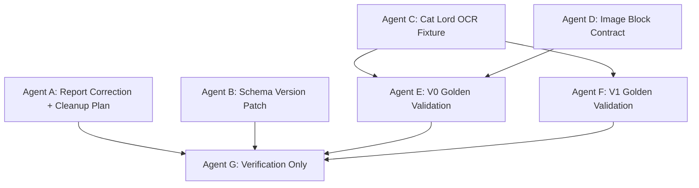

# Finer 多 Agent 下一轮任务布置

> 基于 `docs/multi-agent-execution-report.md` 的审阅结果制定。当前结论是: 基础合约和最小规则链路通过单测，但核心猫大人真实样本未完成，因此不建议直接进入 Policy Mapping 主实现。

## 1. 审阅结论

### 1.1 可确认完成

已验证命令:

```bash
pytest tests/test_content_envelope_schema.py tests/test_quality_temporal_evidence_schema.py tests/test_investment_intent_schema.py tests/test_quality_gate.py tests/test_content_standardizer.py tests/test_intent_extractor.py -q
pytest -q
```

结果:
- targeted tests: `165 passed`
- full tests: `508 passed, 21 skipped`

可信完成项:
- V0/V0.5 schema 已落地。
- V1 `NormalizedInvestmentIntent` 已落地。
- Quality Gate 有确定性规则和测试。
- Minimal V0 Processor 可把文本/Markdown 转成 `ContentEnvelope`。
- Minimal Intent Extractor 可从 `ContentEnvelope` 生成规则型 intent。
- `TradeAction`, pipeline, frontend, backtest 未被本轮改动污染。

### 1.2 不能接受的验收口径

`docs/multi-agent-execution-report.md` 存在结论矛盾:
- 报告第 346-382 行明确写 `Agent 4: Cat Lord Fixture + Golden Cases` 阻塞，预期 fixture 文件未创建。
- 报告第 689-705 行又写“允许进入下一阶段”，并把“所有阻塞问题已解决或可接受”打勾。

这不符合 `docs/agent-execution-plan.md` 的完成定义。猫大人样本是当前阶段的核心回归样本，不能被视为可接受缺口。

### 1.3 当前实际阻塞

P0 阻塞:
- 没有 `tests/fixtures/kol/`。
- 没有 `cat_lord_strategy_image_2026_04_26.md`。
- 没有 `expected_v0.json` / `expected_v1.json`。
- 没有 `tests/test_cat_lord_fixture_contract.py`。
- V0 Processor 和 V1 Extractor 只在合成样本上通过，未被真实复杂图片策略压测。

P1 缺口:
- `QualityCard`, `TemporalAnchor`, `EvidenceSpan`, `EntityAnchor` 缺少实例级 `schema_version` 字段。
- Minimal Intent Extractor 只能做关键词匹配，实体抽取很弱。
- V0 Processor 对图片区域、表格、图表仍是文本占位级处理。

P2 工程清理:
- 根目录出现临时脚本/实验文件: `run_tests.py`, `run_tests.sh`, `run_intent_tests.sh`, `test_core.py`, `test_regex.py`, `validate_standardizer.py`。需要确认是否保留；默认应删除或移动到 `scripts/`。
- `.claude/scheduled_tasks.lock` 删除不是本轮任务产物，应继续忽略，除非用户明确要求恢复或提交。

## 2. 下一轮目标

下一轮不是做 V2 Policy Mapping，而是完成 v1.4 的真实样本闭环:

```text
猫大人图片策略
  -> OCR/人工转写 fixture
  -> V0 ContentEnvelope golden case
  -> V0.5 Quality/Temporal/Evidence golden case
  -> V1 NormalizedInvestmentIntent golden case
  -> extractor/standardizer 对真实样本回归测试
  -> Verification Agent 给出 PASS/PARTIAL/FAIL
```

只有这一轮 PASS，才进入 Policy Mapping。

## 3. 已知样本输入

当前可用图片路径:

```text
/Users/zhouhongyuan/Library/Containers/com.bytedance.macos.feishu/Data/Library/Application Support/LarkShell/sdk_storage/cca2e3816618ff1cd423ead1e51b0034/resources/images/img_v3_02114_7cb4416b-0376-499c-9e39-e086723d2f0g.jpg
```

下一轮 Agent 可以基于该图片做真实 OCR 或人工转写。无法识别内容必须写 `[OCR_UNREADABLE]`，禁止由模型补写缺失文字。

## 4. 并行任务安排



推荐先并行启动:
- Agent A
- Agent B
- Agent C
- Agent D

Agent E/F 依赖 Agent C/D 的产物。Agent G 最后执行，只读验收。

## 5. Agent A: Report Correction + Cleanup Plan

### 目标

修正执行报告中的错误验收口径，并处理临时文件归属。

### 允许修改

- `docs/multi-agent-execution-report.md`
- `docs/multi-agent-next-round-plan.md`
- 可删除或移动以下临时文件，但必须先确认它们未被测试依赖:
  - `run_tests.py`
  - `run_tests.sh`
  - `run_intent_tests.sh`
  - `test_core.py`
  - `test_regex.py`
  - `validate_standardizer.py`

### 禁止修改

- `src/finer/**`
- `tests/**`
- `.claude/scheduled_tasks.lock`

### 验收命令

```bash
git status --short
rg -n "Agent 4|阻塞|允许进入下一阶段|PASS|PARTIAL|FAIL" docs/multi-agent-execution-report.md docs/multi-agent-next-round-plan.md
pytest -q
```

### 执行提示词

```text
你负责修正多 Agent 执行报告的验收口径，并清理或归类根目录临时脚本。不要修改 src/finer 或 tests。报告必须明确: Agent 4 未完成，所以当前总体结论只能是 PARTIAL，不能是 PASS。临时文件若删除，先确认 pytest 不依赖它们。完成后运行 git status、rg 和 pytest -q。
```

## 6. Agent B: Schema Version Patch

### 目标

补齐 V0/V0.5 schema 的实例级 `schema_version` 字段，保证所有新增核心模型都可版本化。

### 允许修改

- `src/finer/schemas/quality.py`
- `src/finer/schemas/temporal.py`
- `src/finer/schemas/evidence.py`
- `src/finer/schemas/entity_anchor.py`
- `tests/test_quality_temporal_evidence_schema.py`
- `tests/test_content_envelope_schema.py`

### 禁止修改

- `src/finer/schemas/trade_action.py`
- `src/finer/extraction/**`
- `src/finer/parsing/**`
- 前端和 pipeline

### 合约

以下模型必须新增:

```python
schema_version: str = Field(default="v0.5")
```

模型:
- `QualityCard`
- `TemporalAnchor`
- `EvidenceSpan`
- `EntityAnchor`

测试必须验证:
- 默认 `schema_version == "v0.5"`
- `model_dump()` 包含 `schema_version`
- `from_dict()` 或 `model_validate()` 后保留版本

### 验收命令

```bash
pytest tests/test_quality_temporal_evidence_schema.py tests/test_content_envelope_schema.py -q
python -m compileall src/finer/schemas
```

### 执行提示词

```text
你负责补齐 V0/V0.5 schema 的实例级 schema_version 字段。只允许修改列出的 schema 和测试。不要改 TradeAction，不要改 extractor。完成后运行指定测试和 compileall，并汇报字段兼容性影响。
```

## 7. Agent C: Cat Lord OCR Fixture

### 目标

用真实图片创建猫大人 fixture。该 Agent 只做样本和 golden case，不改业务代码。

### 允许修改

- `tests/fixtures/kol/cat_lord_strategy_image_2026_04_26.md`
- `tests/fixtures/kol/cat_lord_strategy_image_2026_04_26.expected_v0.json`
- `tests/fixtures/kol/cat_lord_strategy_image_2026_04_26.expected_v1.json`
- `tests/test_cat_lord_fixture_contract.py`
- `docs/specs/cat-lord-golden-case.md`

### 禁止修改

- `src/finer/**`

### 输入图片

```text
/Users/zhouhongyuan/Library/Containers/com.bytedance.macos.feishu/Data/Library/Application Support/LarkShell/sdk_storage/cca2e3816618ff1cd423ead1e51b0034/resources/images/img_v3_02114_7cb4416b-0376-499c-9e39-e086723d2f0g.jpg
```

### Fixture 合约

Markdown fixture 必须包含:
- source image path
- creator: `猫大人`
- source_type: `image`
- published_at: 如果无法从图中严格确认，写 `unknown`
- OCR text，无法识别处写 `[OCR_UNREADABLE]`
- 明确分区:
  - 正文策略区
  - 市场/指数区
  - 板块/行业区
  - 个股区
  - 表格区
  - 图表区
  - 社交媒体 UI 噪声区

`expected_v0.json` 必须至少包含:
- `source_type = image`
- `creator_name = 猫大人`
- 至少 8 个 block
- 至少 3 种 block type
- 每个 block 有 quality dimensions
- 投资相关 block 有 evidence span

`expected_v1.json` 必须至少包含:
- 至少 5 条 intent
- 覆盖市场、板块、个股、风险、表格/图表证据
- 不出现仓位百分比，除非原文明确给出
- 每条 intent 有 evidence span id
- 有 ambiguity flags，不确定内容不能被丢弃

### 验收命令

```bash
pytest tests/test_cat_lord_fixture_contract.py -q
python -m json.tool tests/fixtures/kol/cat_lord_strategy_image_2026_04_26.expected_v0.json >/tmp/cat_v0.json
python -m json.tool tests/fixtures/kol/cat_lord_strategy_image_2026_04_26.expected_v1.json >/tmp/cat_v1.json
```

### 执行提示词

```text
你负责创建猫大人图片策略真实 fixture 和 golden cases。只允许修改 tests/fixtures/kol、test_cat_lord_fixture_contract.py 和 docs/specs/cat-lord-golden-case.md。不要改 src/finer。输入图片路径已给出。OCR/转写必须忠于图片，无法识别写 [OCR_UNREADABLE]，禁止补写缺失内容。完成后运行 fixture 测试和 json.tool。
```

## 8. Agent D: Image Block Contract

### 目标

加强 V0 Processor 对图片策略文本的 block 识别能力，尤其是 `[TABLE_REGION]`, `[CHART_REGION]`, `[IMAGE_REGION]`, `[OCR_UNREADABLE]`。

### 允许修改

- `src/finer/parsing/content_standardizer.py`
- `tests/test_content_standardizer.py`
- `docs/specs/quality-gate.md`

### 禁止修改

- `src/finer/schemas/**`
- `src/finer/extraction/**`
- `tests/fixtures/kol/**`

### 合约

新增或完善识别:
- `[TABLE_REGION]` -> `table`
- `[CHART_REGION]` -> `chart`
- `[IMAGE_REGION]` -> `image_region`
- `[OCR_UNREADABLE]` -> `unknown` 或低质量 `image_region`

质量卡要求:
- 表格/图表 OCR 不完整不能直接 reject，应进入 review。
- UI 噪声应低金融相关性。
- 正文策略段落应保持 evidence traceability。

### 验收命令

```bash
pytest tests/test_content_standardizer.py tests/test_quality_gate.py -q
python -m compileall src/finer/parsing
```

### 执行提示词

```text
你负责加强图片策略文本的 block 合约。只允许修改 content_standardizer、相关测试和 quality-gate 文档。不要改 schema，不要改 extractor。目标是支持 TABLE_REGION/CHART_REGION/IMAGE_REGION/OCR_UNREADABLE，并让不同 block 生成合理 quality_card。完成后运行指定测试和 compileall。
```

## 9. Agent E: V0 Golden Validation

### 目标

将 Agent C 的猫大人 Markdown fixture 通过 V0 Processor 转成 `ContentEnvelope`，并与 `expected_v0.json` 做结构校验。

### 允许修改

- `tests/test_cat_lord_v0_pipeline.py`
- `tests/fixtures/kol/cat_lord_strategy_image_2026_04_26.expected_v0.json`

### 禁止修改

- `src/finer/**`

### 验收命令

```bash
pytest tests/test_cat_lord_fixture_contract.py tests/test_cat_lord_v0_pipeline.py tests/test_content_standardizer.py -q
```

### 执行提示词

```text
你负责验证猫大人 fixture 到 V0 ContentEnvelope 的真实链路。只允许修改 V0 pipeline 测试和 expected_v0 golden case。不要改业务代码。测试必须调用现有 standardize_image_strategy 或 standardize_markdown_source，并校验 block 数量、类型、质量卡和 evidence span。
```

## 10. Agent F: V1 Golden Validation

### 目标

将猫大人 V0 输出输入 Minimal Intent Extractor，并与 `expected_v1.json` 做最小黄金校验。

### 允许修改

- `tests/test_cat_lord_v1_pipeline.py`
- `tests/fixtures/kol/cat_lord_strategy_image_2026_04_26.expected_v1.json`
- 如确实因真实样本暴露规则缺口，可修改:
  - `src/finer/extraction/intent_extractor.py`
  - `tests/test_intent_extractor.py`

### 禁止修改

- `src/finer/schemas/trade_action.py`
- `src/finer/backtest/**`
- `src/finer/pipeline/**`

### 验收标准

至少验证:
- 输出 intent >= 5
- 每条 intent 有 evidence span
- 至少一条 market/index intent
- 至少一条 sector intent
- 至少一条 stock intent
- 至少一条 risk/uncertainty intent
- 至少一条 intent 绑定表格或图表相关 evidence
- 不生成仓位百分比

### 验收命令

```bash
pytest tests/test_cat_lord_v1_pipeline.py tests/test_intent_extractor.py -q
python -m compileall src/finer/extraction
```

### 执行提示词

```text
你负责验证猫大人 fixture 到 V1 intent 的真实链路。优先只写测试和 golden case；只有真实样本暴露 minimal extractor 明显规则缺口时，才允许小幅修改 intent_extractor。禁止生成 TradeAction 和仓位。完成后运行指定测试和 compileall。
```

## 11. Agent G: Verification Only

### 目标

独立验收下一轮。只读，不改文件。

### 禁止操作

- 不允许 `apply_patch`
- 不允许写文件
- 不允许删除临时文件
- 不允许修测试

### 检查命令

```bash
git status --short
git diff --name-only

pytest tests/test_cat_lord_fixture_contract.py tests/test_cat_lord_v0_pipeline.py tests/test_cat_lord_v1_pipeline.py -q
pytest tests/test_content_envelope_schema.py tests/test_quality_temporal_evidence_schema.py tests/test_investment_intent_schema.py tests/test_quality_gate.py tests/test_content_standardizer.py tests/test_intent_extractor.py -q
pytest -q
python -m compileall src/finer
python -m json.tool tests/fixtures/kol/cat_lord_strategy_image_2026_04_26.expected_v0.json >/tmp/cat_v0.verify.json
python -m json.tool tests/fixtures/kol/cat_lord_strategy_image_2026_04_26.expected_v1.json >/tmp/cat_v1.verify.json
```

### 强制判定规则

PASS 条件:
- 猫大人 fixture 文件存在。
- V0/V1 golden JSON 合法。
- 猫大人 V0/V1 pipeline 测试通过。
- full pytest 通过。
- 报告结论不再把未完成阻塞写成 PASS。
- schema_version P1-P4 已修复。

PARTIAL 条件:
- 基础测试通过，但猫大人真实样本仍未闭环。
- 或 schema_version 已修复但 V1 golden 仍不稳定。

FAIL 条件:
- full pytest 失败。
- fixture 含模型补写内容且没有标 `[OCR_UNREADABLE]`。
- intent 无 evidence span。
- 出现 TradeAction 或仓位映射。

### 执行提示词

```text
你是 Verification Only Agent。只允许读文件和运行命令，不允许修改任何文件。请严格按 docs/multi-agent-next-round-plan.md 的检查命令执行。最终给出 PASS/PARTIAL/FAIL，并列出阻塞问题、非阻塞问题、命令结果和是否允许进入 Policy Mapping。
```

## 12. 是否进入 Policy Mapping

当前建议: 暂缓。

理由:
- Policy Mapping 依赖 V1 intent 的稳定性。
- 当前 intent extractor 还没有被猫大人真实复杂图片策略压测。
- 若现在进入 V2，会把 OCR/拆块/实体/证据链问题提前传递到 TradeAction 和回测。

下一轮 PASS 后，才启动:
- V2 Global Base Policy
- Style Archetype Policy
- Risk Preference Policy
- KOL Persona Policy
- Intent -> TradeAction mapping
