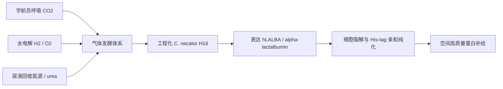

# SCUT-China iGEM 2025 项目详细内容文档

访问来源：[SCUT-China iGEM 2025 Wiki](https://2025.igem.wiki/scut-china/)  
生成日期：2026-05-27  
说明：本文基于 SCUT-China 2025 iGEM Wiki 公开内容整理，属于项目内容梳理与二次归纳，不构成对实验结果的独立复核。Wiki 页脚声明内容采用 [Creative Commons Attribution 4.0 International](https://creativecommons.org/licenses/by/4.0/) 许可。

## 1. 项目一句话概括

SCUT-China 2025 的项目试图把飞船或空间站改造成一个可自持的生物制造系统：利用氢氧化细菌 `Cupriavidus necator H16` 消耗宇航员呼出的 CO2、尿液回收得到的含氮资源，以及水电解产生的 H2/O2，在空间环境中原位生产人源 alpha-lactalbumin，缓解长期航天任务中高质量蛋白补给、储存降解、运输成本和空间废弃物问题。

项目首页给出的愿景是：将航天器转化为自维持的生命系统。核心关键词包括 `Cupriavidus necator H16`、原位资源利用、气体发酵、alpha-lactalbumin、闭环系统、代谢建模和空间合成生物学。

## 2. 问题背景

长期载人航天任务面临三个直接问题：

1. 食品营养与活性衰减。Wiki 中提到，国际空间站预包装食品较单调，乳清蛋白储存 6 个月后活性下降约 30%，长期航天还会造成肌肉流失等生理问题。
2. 地球补给成本极高。项目描述页给出的估算是，NASA 低地轨道运输成本约 10000 美元/kg，3 人 180 天火星任务的蛋白补给成本超过 200 万美元；贡献页进一步估计，若以闭环方式生产蛋白，180 天火星任务可节省超过 360 万美元运输成本。
3. 预包装食品不可循环，会产生额外空间废弃物。项目希望把 CO2、尿液氮源和水电解氢氧气纳入闭环循环，把废弃物转化为营养产品。

项目由一个直观问题触发：如果长期吃冻干食品都会觉得营养不足，宇航员长期依赖预包装食品是否会面临更严重的营养问题。由此团队转向空间原位营养生产。

## 3. 项目目标

Wiki 的项目目标可以归纳为四类：

| 目标 | 内容 |
| --- | --- |
| 生物制造 | 工程化 `Cupriavidus necator H16`，使其将宇航员废弃物流转化为人源 alpha-lactalbumin。 |
| 反应器系统 | 设计可在空间站运行的气体发酵反应器，考虑微重力控制、温控、传感和微生物 containment。 |
| 可复用工具 | 共享优化后的 `C. necator H16` 表达系统、自养发酵参数和代谢模型，为未来 ISRU 与极端环境生物制造项目提供参考。 |
| 社会沟通 | 面向不同年龄群体做公众参与，收集对空间生物制造和工程菌食品的接受度。 |

## 4. 为什么选择 `Cupriavidus necator H16`

团队最初考虑过蓝藻，但蓝藻需要稳定光源，会提高能耗，而且不能直接利用水电解产生的氢气。`Cupriavidus necator H16` 的优势在于：

- 可利用 H2 作为电子供体、CO2 作为碳源、O2 作为电子受体，适合气体发酵和空间站资源循环。
- 与空间站已有或可获得资源匹配：H2/O2 可由水电解获得，CO2 来自宇航员呼吸。
- Wiki 安全页称其为非致病、环境来源、BSL-1 微生物，ATCC 17699 也将其列为 Biosafety Level 1。
- 作为氢氧化细菌平台，已有文献和工具包支持异源蛋白表达与 CO2 valorization。

项目将它定位为“空间微型生物工厂”。

## 5. 为什么选择人源 alpha-lactalbumin

团队最初考虑过牛血清白蛋白，但认为人源蛋白的氨基酸组成更贴近人体需求。选择 alpha-lactalbumin 的主要原因包括：

- 是人乳蛋白的重要组分，Wiki 描述页称其约占人乳蛋白 22%。
- 支链氨基酸含量较高，团队认为可帮助抵抗微重力导致的肌肉和骨量损失。
- 色氨酸含量较高，可能有助于缓解长期空间任务中的心理压力。
- 消化率高，Wiki 多处描述其消化率超过 90%。
- 分子量约 14 kDa，结构相对简单，适合微生物表达和纯化。
- 人源 alpha-lactalbumin 相比牛/羊来源蛋白，被团队认为具有更低致敏性、更好生理兼容性和更强钙结合性质。

项目不只是生产普通蛋白，而是尝试生产一种面向宇航员生理需求的功能性营养蛋白。

## 6. 总体技术路线

项目技术路线可以抽象为一个闭环生物制造系统：

关键设计点：

- 底盘：`Cupriavidus necator H16`。
- 目标基因：人源 `hLALBA`。
- 表达载体：Wiki 描述页写作 `pBBR1`，工程页和结果页进一步提到 `Para-RBS1-eGFP`、`pBBR1MCS` 等骨架。
- 表达策略：优先采用胞内表达，而不是分泌表达；理由是革兰氏阴性菌分泌效率通常较低，且胞内表达在 `C. necator H16` 中更稳定。
- 诱导系统：筛选 `pAra/PBAD`、`pIPTG/Plac`、`pCumate/Pcmt`、`pRha/PrhaBAD` 后，选择 arabinose / `PBAD` 作为标准诱导系统。
- 折叠辅助：比较 `hPDIA3`、`KAR2-SLY1`、`SLY1` 等分子伴侣组合，提高目标蛋白可溶表达。
- 代谢改造：通过 CRISPR-Cas9 尝试敲除竞争代谢通路基因，把代谢流导向目标蛋白合成。
- 反应器：为微重力气液接触设计多层不锈钢填料和柔性软包容器，集成 pH 与溶氧传感。

## 7. 湿实验工程循环

### 7.1 Cycle 1：设计、构建与表达验证

**Design**

团队选择人源 alpha-lactalbumin，采用胞内表达策略，并引入分子伴侣促进折叠。工程页明确说明，团队考虑过胞内表达与分泌表达，但根据 `C. necator H16` 的异源蛋白生产经验和空间能耗限制，最终选择胞内表达。

**Build**

- 选用 `Para-RBS1-eGFP` 作为表达骨架。
- 载体带有 kanamycin resistance marker 和 L-arabinose 诱导的 `araBAD` promoter。
- 对人源 alpha-lactalbumin 编码序列进行 `C. necator` 密码子优化。
- 在 C 端加入 `6xHis` tag，便于后续亲和纯化。
- 用 Gibson Assembly 将 `hLALBA` 表达 cassette 放置到 `Para` 启动子下游，替换原 eGFP reporter。
- 构建两组分子伴侣方案：Group A 为 `hPDIA3`，Group B 原设计为 `KAR2-SLY1`。

**Test**

- Group A 经测序确认构建正确。
- Group B 多次出现 junction error 或异常条带，未获得正确的 `KAR2-SLY1` 双伴侣构建。
- 团队将 Group B 拆分测试，发现 `SLY1` 单独构建可得到正常结果，因此将 Group B 改为 `SLY1` 单伴侣构型。
- 转入氢氧化细菌后，经 L-arabinose 诱导、细胞裂解、SDS-PAGE 和 Western blot 检测，观察到与目标蛋白分子量相符的条带，anti-His 检测确认带有 His tag。

**Learn**

- `Para` 系统在未诱导状态下泄漏较低。
- arabinose 诱导后可在氢氧化细菌中表达 His-tagged alpha-lactalbumin。
- His tag 只能快速确认表达与纯化，不代表蛋白已经正确折叠；后续仍需要结构、活性或消化特性验证。
- `KAR2-SLY1` 组合构建失败提示后续可尝试 Golden Gate 或更长同源臂等克隆策略。

### 7.2 Cycle 2：诱导系统与自养条件优化

**诱导系统筛选**

团队在同一 `pBBR1MCS` 骨架上构建四个 mRFP reporter 质粒，比较：

| 系统 | 表达结果 | 泄漏情况 | 结论 |
| --- | --- | --- | --- |
| `PBAD` / arabinose | 约 800-fold induction | 未检测到明显 basal expression | 最优标准系统 |
| `Plac` / IPTG | 约 400-fold induction | 背景泄漏显著 | 不适合精确调控 |
| `PrhaBAD` / rhamnose | 约 30-fold induction | 泄漏低 | 可作低背景备选 |
| `Pcmt` / cumate | 约 50-fold induction | 泄漏低 | 可作稳定表达备选 |

Notebook 页进一步记录，L-arabinose 的最佳使用条件被确定为接种后立即加入，浓度为 2 g/L。

**自养条件与氮源验证**

Wiki 描述页给出自养气体比例：`H2 : O2 : CO2 = 7 : 2 : 1`。团队在自养条件下继续比较 `Ara`、`Rha` 和 `Cumate` 三个系统，排除了泄漏较高的 IPTG 系统。

氮源方面，团队比较了 ammonium sulfate、urea 以及组合条件。结果页显示：

- 仅 ammonium sulfate 条件下，`C. necator H16` 生长很弱。
- 使用 urea 作为氮源时，细胞可保持稳定、显著增长。
- 表达 `hPDI` 的 A12 株系比表达 `SLY1` 的 B10 株系更高效利用 urea，生长更快，最终 biomass 更高。

项目因此把 urea 视为可代表尿液回收氮源的空间可用底物。

### 7.3 Cycle 3：扩大培养与蛋白纯化

Cycle 3 的目标是把已验证的表达菌株扩展到较大培养尺度，然后进行细胞破碎、可溶蛋白提取、His-tag 亲和纯化和产量检测。

结果页报告：

- Western blot 显示 L-arabinose 诱导样品出现强目标条带，未诱导样品几乎没有条带。
- Ni-NTA 亲和纯化后，SDS-PAGE 在约 14.2 kDa 处观察到清晰条带，符合 alpha-lactalbumin 的预期分子量。
- BCA 检测得到纯化蛋白浓度：

| Elution condition | Group A: `hLALBA-hPDI` | Group B: `hLALBA-SLY1` |
| --- | ---: | ---: |
| 250 mM imidazole | 197.41 ug/mL | 182.82 ug/mL |
| 500 mM imidazole | 139.92 ug/mL | 135.63 ug/mL |

工程页还给出与 `E. coli` 的比较，显示 `C. necator` 产量低于 `E. coli` 部分组合，但与部分原核宿主的文献结果处于可比较范围。需注意：工程页个别段落存在 `ug/mL` 与 `mg/mL` 表述混杂，本文以 Results 页表格的 `ug/mL` 为准。

## 8. Genetic Parts 与构件体系

Parts 页将项目构件分为 basic parts、component parts 和 knockout pathways。

### 8.1 目标蛋白与表达相关 parts

| 类型 | Part / 名称 | 功能 |
| --- | --- | --- |
| Target product | `BBa_25O7DG1M` | `hLALBA-Hisx6` |
| Molecular chaperone | `BBa_25L93JX2` | `hPDIA3` |
| Molecular chaperone | `BBa_25H8JIYJ` | `SLY1` |
| Molecular chaperone | `BBa_2595ZFAK` | `KAR2` |
| Selectable marker | `BBa_K5119015` | `KanR` |
| Vector | `BBa_25P0JE67` | `pBBR1 ori` |
| Vector | `BBa_25FMQEDS` | `pBBR1-REP` |
| Tag | `BBa_K4587201` | His-tag |
| Regulation | `BBa_K2779903` | `AraC` |
| Regulation | `BBa_K4491007` | `araBAD promoter` |
| Terminator | `BBa_K4624000` | `rrnB T1 terminator` |
| RBS | `BBa_25C42D9X` | RBS |
| Promoter | `BBa_K4790075` | T7 promoter |

### 8.2 Composite parts

| Part | 组合 | 备注 |
| --- | --- | --- |
| `BBa_25XIMGHV` | `hLALBA-His-tag-KAR2-SLY1` | 原 Group B 双伴侣方向 |
| `BBa_25VNXIYG` | `hLALBA-His-tag-hPDI-A3` | Group A |
| `BBa_25R4VG8R` | `hLALBA-SLY1` | Parts 页标记为 BEST |
| `BBa_2526WIXT` | `hLALBA-hPDI-A3` | Parts 页标记为 BEST |

Parts 页总结认为，使用 `SLY1` 作为分子伴侣的质粒在氢氧化细菌中表现最好；Results 页的纯化浓度则显示 `hPDI` 组在 250 mM imidazole 下略高。两处侧重点不同：一个偏构建/表达表现，一个偏最终纯化浓度。

## 9. 代谢工程与 gene knockout 设计

项目希望敲除竞争代谢通路，将碳源、氮源、能量与氨基酸前体更多导向目标蛋白合成。

Parts 页列出的 knockout 候选包括：

| Priority | Gene number | Enzyme / pathway | 判断 |
| --- | --- | --- | --- |
| high | `H16_A3598` | Glyoxylate carboligase / glyoxylate pathway | 模型认为提高生产概率最高，单基因、较易操作 |
| medium-high | `H16_A2227 / H16_A2211` | Isocitrate lyase / glyoxylate shunt | 双基因，风险中等 |
| medium-high | `H16_A3015` | Imidazolone propionase / histidine degradation | 单基因，优化氮源利用 |
| medium-high | `H16_A3631` | Proline dehydrogenase / proline degradation | 单基因，保存 Pro 与 NADPH |
| medium | `H16_A3012 / H16_B0345 / H16_B1441` | Gluconolactonase | 三基因，复杂度更高 |
| not recommended | `H16_A3146 / B1386 / PHG418` | GAPDH | 中心代谢核心反应，高风险 |
| not recommended | `H16_B0103 / A2528` | Fumarase C | TCA cycle 核心反应，高风险 |

Theoretical 页最终将 `H16_A3598` 对应的 `R_GLYOCARBOLIG_RXN` 作为综合选择，理由是减少 glyoxylate branch flux，把更多碳流导向 TCA cycle、能量和氨基酸供应。

Notebook 页记录团队在 9 月进行 CRISPR-Cas9 knockout，筛选目标写作 `aceA, gcl, hutI, putA`；Description 页写作 `areA, gcl, put, hut`。这里存在命名不一致，后续若要复现实验或引用，应以质粒序列、sgRNA 设计或 registry 记录为准。

## 10. 干实验与理论产量分析

### 10.1 Feasibility Analysis

Feasibility Analysis 页基于模型分析自养和异养条件。

在自养条件下：

- pFBA 显示 ATP maintenance 反应有显著 flux，说明基础代谢能量需求刚性存在。
- Hydrogenase 反应和 Calvin cycle 关键反应非零，说明氢氧化与 CO2 固定是主要驱动机制。
- FVA 显示 urease reaction 有较宽 flux range，表示氮代谢存在调节弹性；ATP maintenance 与 hydrogenase 更接近刚性要求。
- 结论是：自养条件下可以维持生长并产生少量 lactoprotein，属于“低产但机制可行”。

在异养条件下：

- 当 lactoprotein synthesis 与 biomass growth 被模型耦合后，pFBA 显示 lactoprotein flux 不再为零，而是随 growth rate 同步提高。
- Urease 反应继续承担重要氮源供应作用。
- FVA 显示 biomass、lactoprotein synthesis、ATP maintenance 等 flux 被最优解锁定，urease 是主要可变部分。

核心判断：默认最大生长目标下，细胞会优先把资源分配到 biomass，目标蛋白 flux 可能为零；通过代谢工程或目标函数耦合，产品合成可以被激活。

### 10.2 Theoretical Yield Prediction

Theoretical 页基于 COBRApy 建模，目标包括：

- 最大化 protein secretion flux。
- 优化 growth rate 和 protein flux 的加权目标。

重要数值：

| 项目 | 数值 / 结论 |
| --- | --- |
| Urea 氮质量分数 | 46.6% |
| 蛋白平均氮质量分数 | 16% |
| 理论 urea-to-protein 上限 | `2.9125 * m_urea` |
| 指定模拟下 maximum biomass production rate | 2.4337 h^-1 |
| target-protein synthesis flux | 0.1188 mmol gDW^-1 h^-1 |
| 假设 OD600 = 0.4 / DCW = 0.20 g/L 时日产量 | 0.2852 g L^-1 d^-1 |

### 10.3 宇航员排泄物供需匹配

Theoretical 页用 6 人乘组估算 urea 回收能否覆盖蛋白需求：

| 参数 | 数值 |
| --- | ---: |
| 每人每日尿液 | 1.4 L/d |
| 平均 urea 浓度 | 25.745 g/L |
| 乘组人数 | 6 |
| 每人每日蛋白需求 | 80 g/d |
| 系统氮转化效率 | 0.8 |
| 每日总 urea | 216.26 g/d |
| 每日蛋白需求 | 480 g/d |
| 理论蛋白供应 | 502.92 g/d |

结论：在 80% 系统氮转化效率假设下，6 名宇航员每日 urea 产生量理论上足够覆盖每日蛋白需求，并有小幅盈余。

### 10.4 Conversion efficiency

Theoretical 页进一步比较 H2/CO2 medium 与 heterotrophic medium：

| Efficiency metric | H2/CO2 medium | Heterotrophic medium |
| --- | ---: | ---: |
| Nitrogen efficiency | 0.017 | 0.020 |
| Carbon efficiency | 0.015 | 0.003 |
| Hydrogen efficiency | 0.037 | 267.832 |

该页的解释是：异养条件更擅长将 urea 转化为蛋白，尤其在有合适有机碳补充时，微生物能更高效地把宇航员来源 urea 转化为目标蛋白；自养路线具备空间资源闭环意义，但能量供应和固定效率限制了产出。

## 11. 人源 alpha-lactalbumin 改造设计

Modification 页的核心目标不是提高表达量，而是提高产物在人体消化中的可吸收性。

### 11.1 生物学假设

alpha-lactalbumin 的营养价值不仅取决于氨基酸组成，还取决于消化产物能否被小肠上皮高效吸收。团队关注 PepT1，即 proton-coupled peptide transporter 1，认为二肽和三肽通过 PepT1 的吸收通路非常重要。

因此，项目提出通过在 alpha-lactalbumin 表面引入特定蛋白酶切位点，控制消化产物谱，尽量生成可由 PepT1 运输的二肽或三肽。

### 11.2 改造边界

不能破坏 alpha-lactalbumin 的核心结构：

- 四组二硫键区域需避免突变：Cys6-Cys120、Cys28-Cys111、Cys61-Cys77、Cys73-Cys91。
- 高亲和 Ca2+ binding loop 需避免破坏，成熟蛋白对应约 79-88 位残基，涉及 Lys79、Asp82、Asp84、Asp87、Asp88 等。
- apo-protein 状态下结构稳定性下降，若突变影响 Ca2+ 结合，可能增加蛋白错误折叠或蛋白酶敏感性。

### 11.3 位点筛选方法

团队使用以下指标筛选可改造位点：

- 同源序列比对与 Shannon entropy，寻找高度可变、演化上更能容忍突变的位置。
- Sequence logo 分析，排除高度保守残基。
- 三维结构映射，确认候选残基位于蛋白表面而不是核心。
- SASA 溶剂可及性分析，优先选择高暴露残基。
- Delta-delta-G 预测，用 CUPSAT 与 MUpro 交叉判断突变对稳定性的影响。
- 产物导向分析，判断 trypsin digestion 后是否更可能生成二肽/三肽。

Modification 页指出，Top 10 高变异位点中很多集中在 C 端，如 `LEU123`、`LYS122`、`GLU121`、`GLU116`、`LYS114`、`GLU113`，说明 C 端柔性、暴露，是理想改造区域。

### 11.4 最终突变设计

团队重点比较 `E121K`、`E121R`、`L123K`、`L123R`。

稳定性预测：

| Mutation | CUPSAT ddG | MUpro ddG | 判断 |
| --- | ---: | ---: | --- |
| `E121K` | -0.20 | -0.54 | 两个模型都预测更稳定，最理想 |
| `E121R` | -0.24 | -0.40 | 两个模型都预测更稳定 |
| `L123K` | -0.28 | +0.11 | 风险较低 |
| `L123R` | -0.54 | +0.32 | 风险较低 |

产物导向分析认为：

- `E121` 改造后，C 端序列变为 `Cys120-Lys121-Lys122-Leu123`，更有利于产生 PepT1 可运输的二肽。
- `L123` 改造后，trypsin 更可能在天然 `Lys122` 后切割，释放单个 Lys，而单氨基酸不走 PepT1 二肽/三肽通路，因此功能输出较差。

最终方案：选择 `E121K/R` 作为 trypsin cleavage site 改造的优先目标。

### 11.5 分子对接结果

Modification 页给出与 trypsin 对接的比较：

| 指标 | Wild type | `E121K` | `E121R` | 解释 |
| --- | ---: | ---: | ---: | --- |
| Docking score | -287.67 | -372.37 | -315.40 | 突变体亲和力理论上更优，`E121K` 最强 |
| Interface H-bonds | 7 | 12 | 11 | 突变体界面氢键更多 |
| Ligand RMSD | 0.35 nm | 0.22 nm | 0.25 nm | 突变体结合姿态更稳定 |
| Catalytic distance | 5.8 A | 3.5 A | 3.7 A | 突变体更接近理想催化距离 |

该结果支持团队对 `E121K/R` 的选择，但仍属于计算预测，需要后续体外消化实验、LC-MS 肽段分析和营养吸收模型进一步验证。

## 12. Notebook 时间线

| 时间 | 阶段 | 内容 |
| --- | --- | --- |
| 6 月 23 日前 | 背景研究 | 调研航天再生生命保障、航天器废气/废物处理、氢氧化细菌代谢工程和蛋白需求。 |
| 6 月 23-29 日 | Plasmid strategy | 确定目标基因 `hLALBA` 和质粒策略，筛选 hPDI、KAR2-SLY1 伴侣。 |
| 6 月 30 日-7 月 6 日 | Primer / synthesis | 设计引物，委托片段合成，建立培养基和反应条件。 |
| 7 月 7-13 日 | Plasmid construction | 质粒构建并用 PCR 验证。 |
| 7 月 14-20 日 | Transformation | 转入 `E. coli BL21` 和 `C. necator H16`，用 colony PCR 和测序确认。 |
| 7 月 21 日-8 月 3 日 | Heterotrophic expression | LB 异养发酵，SDS-PAGE / Western blot 验证表达；筛选诱导系统，确定 L-arabinose。 |
| 8 月 4-17 日 | Purification | 裂解收集蛋白，Ni column 纯化。 |
| 8 月 18-24 日 | Protein concentration | BCA 检测蛋白浓度。 |
| 8 月 11-24 日 | Autotrophic expression | 气体混合物自养发酵，测 OD600、生长曲线，比较诱导系统和氮源。 |
| 8 月 25 日-9 月 8 日 | Autotrophic purification | 自养样品裂解、Ni column 纯化、BCA 检测。 |
| 9 月 8-14 日 | Knockout screening | 通过 in silico 预测和代谢通路评估筛选 knockout targets。 |
| 9 月 15-28 日 | CRISPR-Cas9 / LC-MS | knockout 实验因 sgRNA 质粒提取浓度异常和测序异常而重启；同时进行目标蛋白条带切胶、胰蛋白酶消化、C18 分离和 MS 数据库检索设计。 |

Notebook 页说明，由于 knockout 实验重启，wiki freeze 前未能展示 knockout 后的蛋白表达结果。

## 13. Human Practices 与公众反馈

### 13.1 专家反馈如何改变技术路线

项目的人类实践不是单纯宣传，而是直接影响了实验设计：

- 刘裕钟研究员建议放弃分泌表达，改用细胞裂解获取更高产量，并提醒 knockout 不能只考虑 precursor supply，需考虑全局代谢网络平衡。这推动团队使用 genome-scale modeling 筛选非必需且有助目标蛋白合成的内源基因。
- 田依媛研究员建议氢氧化细菌在气体底物切换时可能存在代谢滞后，可先异养积累 biomass，再转入自养阶段；同时强调诱导系统要优先评估 leakage expression。团队因此排除高泄漏 lactose/IPTG 方向，并确认 arabinose 2 g/L 为最佳诱导条件。
- 吴海燕研究员针对 Ni column 纯化低产问题指出高浓度 imidazole 过早使用会与目标蛋白竞争镍柱结合位点，并建议梯度洗脱。调整后蛋白纯化产量明显提升。

### 13.2 iGEM 团队合作

团队参加 2025 年 5 月第九届 Southern China Regional Meeting，与深圳大学、华南农业大学等团队交流。其他团队质疑原核细胞表达真核基因的可行性，促使 SCUT-China 更谨慎地评估分泌表达和分子伴侣选择。

团队还与 MUST-space 团队交流空间合成生物学和模拟微重力测试。由于跨境政策未能实际转移工程菌，但交流帮助团队明确缺少微重力模拟实验这一关键环节。

### 13.3 公众调查

Human Practices 页记录，团队面向居民收集了 276 份有效问卷；Education 页另提到工程菌食品接受度问卷超过 300 份有效回答。主要发现：

- 超过 80% 受访者对 synthetic biology 不熟悉或只听说过但不了解。
- 约 70% 受访者愿意或可能尝试该产品。
- 在不愿意群体中，主要顾虑是安全性、对来源的心理排斥，以及认为不自然或不健康。
- 产品形式方面，protein energy bars 最受欢迎，148 票，占 53.6%；protein powder 也有较高支持，81 票，占 29.3%。
- 超过 94% 的受访者愿意继续关注项目进展。

公众反馈推动团队把未来产品形式从抽象蛋白产物转向更熟悉、便携的 protein bars / protein tablets。

## 14. Education 与 Public Engagement

团队做了多层次科普：

- 面向儿童：与 CR LAND 合作举办 “Space Odyssey & Cellular Factories” 科学讲座，用动画和比喻讲微生物、合成生物学和空间营养生产。
- 面向社区：与云鹿社区在广东佛山举办 “iGEM Space Supply Station” 太空主题 carnival，用小型“火箭发射”、互动游戏和简单实验介绍 CO2、氢氧化细菌代谢与 alpha-lactalbumin 功能，吸引超过 300 名社区居民。
- 面向大学同辈：举办校内项目分享会，介绍 iGEM、技术路线、建模过程和 human practices；现场人数超过原预期，近 300 人教室无法容纳全部参与者。
- 校园展台：播放宣传视频并设置互动游戏。
- 线上传播：使用小红书、微信公众号、Instagram、Bilibili 等平台发布项目进展、科普文章和活动通知。

## 15. Safety

安全分为实验室安全和项目安全两层。

实验室安全措施：

- 所有成员进入实验室前接受安全培训。
- 实验室张贴安全标识。
- 仪器有具体使用说明和废液处理提示。
- 乙醇等易燃液体放入专用安全柜。
- 气瓶存放于气瓶安全柜，贴有信息标签并定期检查。

项目生物安全：

- `Cupriavidus necator H16` / `Ralstonia eutropha H16` 被描述为非致病、环境来源菌株。
- ATCC 17699 分类为 BSL-1。
- 自然代谢不产生毒素或 virulence factors。
- 工程菌设计上不产生毒素，也不用于致病功能。

潜在未闭环问题：

- 实际空间环境微重力、辐射和封闭舱长期运行条件尚未验证。
- 工程菌 containment 和产物食品安全需要比 iGEM proof-of-concept 更严格的监管验证。
- alpha-lactalbumin 表达已经验证，但折叠、活性、消化产物和过敏风险仍需进一步实验证据。

## 16. Inclusivity 与 Sustainability

项目的 inclusivity 主要体现在三方面：

- 技术应用不局限于空间站，也可延伸到极地科考、深海探索、灾后救援和受气候影响的蛋白供应场景。
- 人源 lactalbumin 通过微生物发酵生产，不直接依赖动物养殖；团队认为其可满足素食和 Halal 等特定需求。
- 团队跨学院协作：生物与生物工程学院负责湿实验，材料学院提供支持，未来技术学院和软件学院参与干实验与建模，设计学院负责 wiki、视频和视觉材料。

项目与 SDGs 的关联：

| SDG | 对应贡献 |
| --- | --- |
| SDG 2 Zero Hunger | 用回收输入生产高质量蛋白，为极端环境和脆弱地区营养供给提供思路。 |
| SDG 12 Responsible Consumption and Production | 把 CO2 和 urea 转化为营养产品，体现 circular economy。 |
| SDG 9 Industry, Innovation and Infrastructure | 发展基于气体底物的生物制造平台和空间基础设施。 |
| SDG 13 Climate Action | 将 CO2 转化为有价值产品，可作为 CCU 思路的一部分。 |
| SDG 3 Good Health and Well-being | 针对肌肉、骨骼和心理压力需求选择功能性蛋白。 |

## 17. Contribution

项目声称对未来 iGEM 队伍、航天领域、极端环境和社会有四类贡献：

### 17.1 对未来 iGEM 队伍

- 验证 `pAra` promoter 在 `C. necator H16` 中有效，并确定 2 g/L Ara 作为最优诱导浓度。
- 验证 `hPDIA3` 和 `SLY1` 有助于人源 alpha-lactalbumin 可溶表达。
- 提供 competitive pathway knockout candidate list。
- 展示从 chassis selection、gas fermentation condition optimization 到 microgravity bioreactor design 的完整方法蓝图。
- 使用 COBRA model 指导 gene knockout、yield prediction、sensitivity 和 robustness analysis。
- 提供围绕非模式菌和工程菌食品的安全与伦理评估框架。

### 17.2 对航天领域

- 避免蛋白长期储存降解，提供原位“新鲜营养”。
- 通过 CO2、H2 和尿液氮源闭环减少地球补给。
- Wiki 估算 180 天火星任务可节省超过 360 万美元运输成本，并减少空间废弃物。

### 17.3 对极端环境

闭环蛋白制造逻辑可迁移到极地、深海、灾后救援等传统供应链受限环境。

### 17.4 对社会

通过社区科普和游戏化互动，把“航天合成生物学”转化为公众可理解的知识，并收集对工程菌食品的态度。

## 18. 当前证据强度与主要缺口

| 模块 | 已有证据 | 仍缺什么 |
| --- | --- | --- |
| 表达构建 | PCR、测序、SDS-PAGE、Western blot 支持表达 | 更完整的重复数、统计分析、批次稳定性 |
| 纯化 | Ni-NTA 与 SDS-PAGE 看到目标条带，BCA 给出浓度 | 纯度百分比、结构确认、活性确认 |
| 自养生长 | urea 条件下生长曲线支持氮源可用 | 严格自养长期稳定生产数据 |
| 代谢模型 | FBA/pFBA/FVA 支持机制可行和供需匹配 | 模型参数与真实发酵数据校准 |
| Knockout | 有候选筛选和 CRISPR-Cas9 计划 | Wiki freeze 前未完成 knockout 后表达结果 |
| 蛋白改造 | E121K/R 有稳定性和 docking 支持 | 真实突变体表达、折叠、消化、LC-MS 和吸收验证 |
| 反应器 | 有微重力气液接触概念设计 | 微重力模拟、密闭舱安全、气体传质效率测试 |
| 食品化 | 公众偏好支持 protein bar / tablet | 食品安全、毒理、过敏、监管路径 |

## 19. 对项目的总体判断

这是一个“空间生命保障 + 合成生物学 + 代谢建模 + 功能蛋白营养”的综合型 iGEM 项目。它的强项不是单一实验指标，而是把空间资源循环问题拆成了可工程化的闭环系统：

- 用 `C. necator H16` 解决 CO2/H2/O2 气体底物利用。
- 用 urea 氮源把尿液回收纳入蛋白合成。
- 用 `hLALBA` 生产面向宇航员肌肉、骨骼和心理压力需求的功能蛋白。
- 用 promoter screening、chaperone co-expression 和 His-tag purification 建立表达验证链条。
- 用 COBRApy 模型和 knockout candidate list 设计下一轮代谢工程。
- 用反应器设计、人类实践和公众调查把 proof-of-concept 扩展到真实应用场景。

但项目仍处于 proof-of-concept 到 early validation 之间，尚未达到可部署系统：

- knockout 优化未完成结果闭环；
- 自养条件下目标蛋白产量仍低；
- 突变 alpha-lactalbumin 的消化吸收优势仍主要来自计算预测；
- 微重力反应器、空间安全和食品安全验证尚未实证完成。

因此，最准确的定位是：该项目提出并部分验证了一套利用航天废弃物流进行原位功能蛋白生产的合成生物学原型系统，已经证明表达和初步纯化可行，但距离空间生命保障系统中的真实部署仍需要多轮工程化、尺度化和安全验证。

## 20. 原始来源索引

- Home: <https://2025.igem.wiki/scut-china/>
- Project Description: <https://2025.igem.wiki/scut-china/description>
- Engineering: <https://2025.igem.wiki/scut-china/engineering>
- Contribution: <https://2025.igem.wiki/scut-china/contribution>
- Notebook: <https://2025.igem.wiki/scut-china/notebook>
- Parts: <https://2025.igem.wiki/scut-china/parts>
- Results: <https://2025.igem.wiki/scut-china/results>
- Feasibility Analysis: <https://2025.igem.wiki/scut-china/feasibility-analysis>
- Modification of Human alpha-Lactalbumin: <https://2025.igem.wiki/scut-china/modification>
- Theoretical Yield Prediction & Pathway Optimization: <https://2025.igem.wiki/scut-china/theoretical>
- Human Practices: <https://2025.igem.wiki/scut-china/human-practices>
- Education & Public Engagement: <https://2025.igem.wiki/scut-china/education>
- Safety: <https://2025.igem.wiki/scut-china/safety>
- Inclusivity: <https://2025.igem.wiki/scut-china/inclusivity>
- Sustainability: <https://2025.igem.wiki/scut-china/sustainability>
