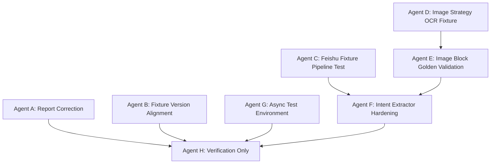

# Finer V0/V1 下一轮多 Agent 任务方案

> 基于 `docs/v0-v1-schema-contract-validation-report.md` 的审阅结果制定。当前结论: V0/V0.5/V1 schema 与飞书文档型猫大人 fixture 已通过验证，但图片策略样本、真实 V0->V1 生成链路、时间解析和 async 测试环境仍未闭环。验收状态: **PARTIAL**。

## 1. 审阅结论

### 1.1 可确认通过

已实际验证:

```bash
pytest tests/test_cat_lord_fixture_contract.py tests/test_content_standardizer.py tests/test_schemas.py -q
pytest tests/test_content_envelope_schema.py tests/test_quality_temporal_evidence_schema.py tests/test_investment_intent_schema.py tests/test_quality_gate.py tests/test_content_standardizer.py tests/test_intent_extractor.py tests/test_cat_lord_fixture_contract.py -q
python -m compileall src/finer/schemas src/finer/parsing src/finer/extraction src/finer/services
pytest -q
```

实际结果:
- fixture/core targeted: `115 passed`
- V0/V1 targeted: `202 passed`
- full suite: `545 passed, 21 skipped`
- compileall: 通过

可信完成:
- `QualityCard`, `TemporalAnchor`, `EvidenceSpan`, `EntityAnchor` 已补 `schema_version`。
- `ContentEnvelope` 已支持 `table_region`, `chart_region`, `ocr_unreadable`。
- `content_standardizer` 已支持 placeholder block 检测。
- 猫大人飞书文档型 fixture 已建立。
- V0/V1 golden JSON 合法，且跨层引用一致。

### 1.2 报告中需要修正的点

`docs/v0-v1-schema-contract-validation-report.md` 仍有三处口径问题:

1. 全项目测试实际是 `545 passed, 21 skipped`，不是 `544 passed, 22 failed`。
2. V0 fixture 的 `schema_version` 是 `v0.1`，与当前 schema 默认 `v0.5` 不一致，不应标为完全无影响。
3. 当前猫大人 fixture 是 `source_type=chat` 的飞书文档会话记录，不是此前目标中的图片策略 OCR fixture。

### 1.3 当前阶段判定

建议判定为:

```text
V0/V1 schema contract: PASS
Feishu/chat fixture validation: PASS
Image strategy fixture validation: PARTIAL
Real V0 processor -> V1 extractor golden pipeline: PARTIAL
Overall readiness for Policy Mapping: NOT YET
```

原因: 当前 V1 golden case 是人工构造并验证可加载，不等于现有 `content_standardizer + intent_extractor` 能从真实猫大人内容自动生成同等质量 intent。

## 2. 下一轮目标

下一轮目标不是直接进入 V2 Policy Mapping，而是把 V0/V1 从“schema 和 fixture 可加载”推进到“真实生成链路可回归”。

目标链路:

```text
猫大人飞书文档 fixture
  -> ContentEnvelope 自动生成
  -> V1 intents 自动生成
  -> golden case 对比

猫大人图片策略 fixture
  -> OCR/人工忠实转写
  -> image/table/chart block 化
  -> V1 intents golden case
```

## 3. 多 Agent 分工



建议并行启动:
- Agent A
- Agent B
- Agent C
- Agent D
- Agent G

Agent E/F 依赖 Agent D/C 的结果。Agent H 最后执行，只读验收。

## 4. Agent A: Report Correction

### 目标

修正 `docs/v0-v1-schema-contract-validation-report.md` 的测试统计和结论边界。

### 允许修改

- `docs/v0-v1-schema-contract-validation-report.md`
- `docs/v0-v1-next-round-plan.md`

### 禁止修改

- `src/finer/**`
- `tests/**`

### 必须修正

- 全量测试结果改为 `545 passed, 21 skipped`。
- 明确 `source_type=chat` 的猫大人 fixture 不是图片策略 fixture。
- 明确当前可进入“真实 V0/V1 生成链路验证”，但暂不进入 V2 Policy Mapping。

### 验收命令

```bash
rg -n "545 passed|21 skipped|source_type=chat|Policy Mapping|PARTIAL|图片策略" docs/v0-v1-schema-contract-validation-report.md docs/v0-v1-next-round-plan.md
pytest -q
```

## 5. Agent B: Fixture Version Alignment

### 目标

修复猫大人 V0 golden case 的 schema version，使 fixture 与当前 schema 默认值一致。

### 允许修改

- `tests/fixtures/kol/cat_lord_strategy_2026_03_12.expected_v0.json`
- `tests/test_cat_lord_fixture_contract.py`

### 禁止修改

- `src/finer/**`

### 合约

- V0 fixture top-level `schema_version` 应改为 `v0.5`。
- 测试必须断言 `schema_version == "v0.5"`。
- 不允许为了通过测试放宽 schema version 校验。

### 验收命令

```bash
pytest tests/test_cat_lord_fixture_contract.py -q
python -m json.tool tests/fixtures/kol/cat_lord_strategy_2026_03_12.expected_v0.json >/tmp/cat_v0.version.json
```

## 6. Agent C: Feishu Fixture Pipeline Test

### 目标

验证现有飞书文档 Markdown fixture 能被 `content_standardizer` 自动转成 V0，并与 golden case 做结构级对比。

### 允许修改

- `tests/test_cat_lord_v0_pipeline.py`
- 如确有必要，仅可调整:
  - `tests/fixtures/kol/cat_lord_strategy_2026_03_12.expected_v0.json`

### 禁止修改

- `src/finer/**`

### 验收标准

测试必须调用真实函数:
- `standardize_markdown_source(...)` 或 `standardize_text_source(...)`

必须校验:
- `creator_name`
- `published_at`
- block 数量范围
- block type 分布
- evidence span 存在
- block order 连续
- generated envelope 与 expected fixture 的关键字段一致

### 验收命令

```bash
pytest tests/test_cat_lord_v0_pipeline.py tests/test_content_standardizer.py -q
```

## 7. Agent D: Image Strategy OCR Fixture

### 目标

补齐此前真正目标: 猫大人超长图片策略 fixture。该任务只做 fixture 和 golden case，不改业务代码。

### 输入图片

```text
/Users/zhouhongyuan/Library/Containers/com.bytedance.macos.feishu/Data/Library/Application Support/LarkShell/sdk_storage/cca2e3816618ff1cd423ead1e51b0034/resources/images/img_v3_02114_7cb4416b-0376-499c-9e39-e086723d2f0g.jpg
```

### 允许修改

- `tests/fixtures/kol/cat_lord_image_strategy_2026_04_26.md`
- `tests/fixtures/kol/cat_lord_image_strategy_2026_04_26.expected_v0.json`
- `tests/fixtures/kol/cat_lord_image_strategy_2026_04_26.expected_v1.json`
- `tests/test_cat_lord_image_fixture_contract.py`
- `docs/specs/cat-lord-image-golden-case.md`

### 禁止修改

- `src/finer/**`

### 合约

Markdown fixture 必须:
- 标明 source image path。
- `source_type=image`。
- KOL 为猫大人。
- 无法识别区域写 `[OCR_UNREADABLE]`。
- 表格区域写 `[TABLE_REGION]`。
- 图表区域写 `[CHART_REGION]`。
- 图片区域写 `[IMAGE_REGION]`。
- 明确区分正文策略、表格、图表、社交媒体 UI 噪声。

V0 expected 必须:
- 至少 8 个 blocks。
- block type 至少包含 `paragraph`, `list`, `table_region` 或 `chart_region`, `image_region` 或 `ocr_unreadable`。
- 每个投资相关 block 有 evidence span。

V1 expected 必须:
- 至少 5 条 intents。
- 覆盖市场/指数、板块、个股、风险/不确定性、表格或图表证据。
- 不生成仓位百分比。
- 模糊内容必须保留 ambiguity flags。

### 验收命令

```bash
pytest tests/test_cat_lord_image_fixture_contract.py -q
python -m json.tool tests/fixtures/kol/cat_lord_image_strategy_2026_04_26.expected_v0.json >/tmp/cat_img_v0.json
python -m json.tool tests/fixtures/kol/cat_lord_image_strategy_2026_04_26.expected_v1.json >/tmp/cat_img_v1.json
```

## 8. Agent E: Image Block Golden Validation

### 目标

验证图片策略 Markdown fixture 经 V0 Processor 后能形成符合预期的 image/table/chart blocks。

### 允许修改

- `tests/test_cat_lord_image_v0_pipeline.py`
- 如真实 fixture 暴露 parser 缺口，可小幅修改:
  - `src/finer/parsing/content_standardizer.py`
  - `tests/test_content_standardizer.py`

### 禁止修改

- `src/finer/schemas/**`
- `src/finer/extraction/**`

### 验收命令

```bash
pytest tests/test_cat_lord_image_v0_pipeline.py tests/test_content_standardizer.py -q
python -m compileall src/finer/parsing
```

## 9. Agent F: Intent Extractor Hardening

### 目标

让 Minimal Intent Extractor 能在飞书文档 fixture 和图片策略 fixture 上产生可解释的 V1 intents。

### 允许修改

- `src/finer/extraction/intent_extractor.py`
- `tests/test_intent_extractor.py`
- `tests/test_cat_lord_v1_pipeline.py`
- `tests/test_cat_lord_image_v1_pipeline.py`

### 禁止修改

- `src/finer/schemas/trade_action.py`
- `src/finer/backtest/**`
- `src/finer/pipeline/**`

### 必须改进

- 不要总是使用 envelope 的第一个 entity anchor 作为所有 intent 的 target。
- 每个 intent 的 target 应优先来自当前 block 的 entity/evidence。
- 支持风险类 intent，不要把所有风险文本粗暴归为 bearish stock action。
- 保留 `ambiguity_flags`。
- 仍然不得生成仓位百分比或 TradeAction。

### 验收命令

```bash
pytest tests/test_intent_extractor.py tests/test_cat_lord_v1_pipeline.py tests/test_cat_lord_image_v1_pipeline.py -q
python -m compileall src/finer/extraction
```

## 10. Agent G: Async Test Environment

### 目标

解决 pytest 配置中 async 选项不被识别、async 测试被 skip 的问题。

### 允许修改

- `pyproject.toml`
- `pytest.ini`
- 测试依赖相关配置文件

### 禁止修改

- 业务代码

### 合约

目标是让 async 测试正常运行，而不是删除/跳过 async 测试。

### 验收命令

```bash
pytest tests/test_enrichment.py tests/test_extraction.py -q
pytest -q
```

## 11. Agent H: Verification Only

### 目标

只读验收。不得修改文件。

### 检查命令

```bash
git status --short
git diff --name-only

pytest tests/test_cat_lord_fixture_contract.py tests/test_cat_lord_v0_pipeline.py tests/test_cat_lord_v1_pipeline.py -q
pytest tests/test_cat_lord_image_fixture_contract.py tests/test_cat_lord_image_v0_pipeline.py tests/test_cat_lord_image_v1_pipeline.py -q
pytest tests/test_content_envelope_schema.py tests/test_quality_temporal_evidence_schema.py tests/test_investment_intent_schema.py tests/test_quality_gate.py tests/test_content_standardizer.py tests/test_intent_extractor.py -q
pytest -q
python -m compileall src/finer
```

### PASS 条件

- 飞书文档 fixture V0/V1 pipeline 测试通过。
- 图片策略 fixture V0/V1 pipeline 测试通过。
- V0 fixture `schema_version == "v0.5"`。
- full pytest 通过，且 async 测试不再被错误 skip。
- 未生成 TradeAction 或仓位映射。

### PARTIAL 条件

- 飞书文档 fixture 通过，但图片策略 fixture 或 async 测试仍未闭环。

### FAIL 条件

- full pytest 失败。
- image fixture 中存在未标注的模型补写内容。
- intent 缺 evidence span。
- extractor 写入 TradeAction 或生成仓位。

## 12. 进入 V2 Policy Mapping 的门槛

必须同时满足:

1. 飞书文档型 KOL 内容 V0/V1 自动生成链路通过。
2. 图片策略型 KOL 内容 V0/V1 自动生成链路通过。
3. Intent target 不再全部依赖 envelope 第一个 entity。
4. async 测试环境问题解决或明确隔离。
5. Verification Agent 给出 PASS。

未满足前，不建议进入 V2 Policy Mapping。
