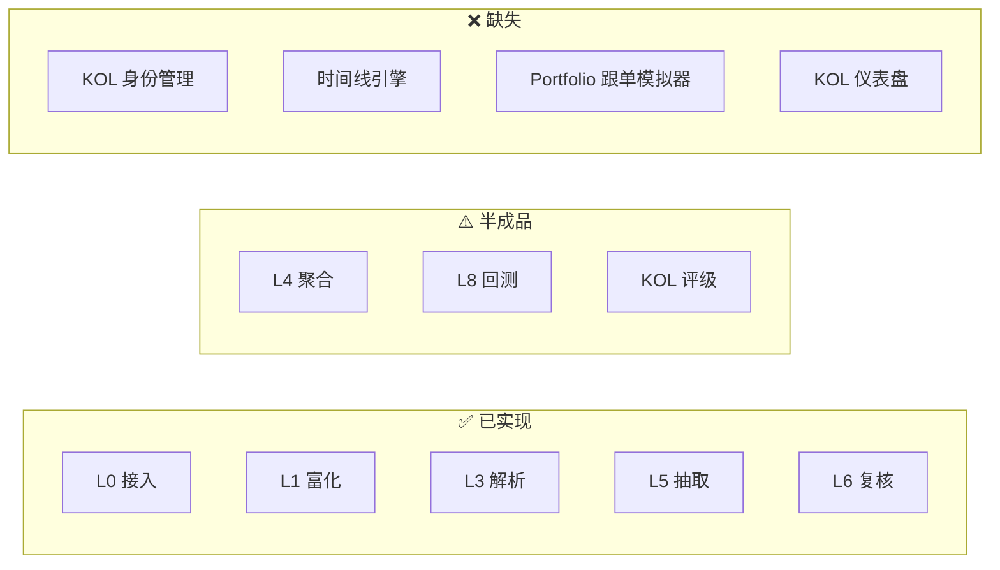
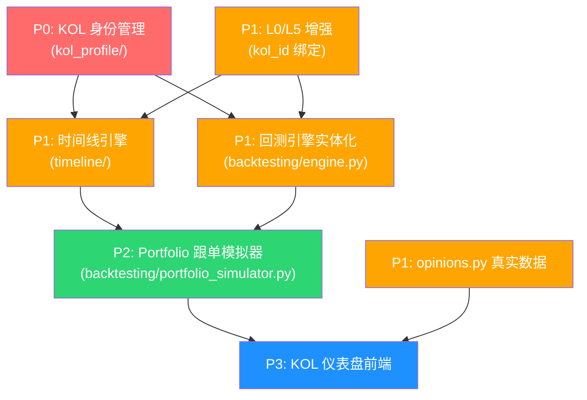

# Finer 项目第一性原理分析：通往最终目标的缺口地图

## 最终目标重述

> **将财经 KOL 的所有发布内容按时间线整理，并进行回测，验证如果对这个 KOL 进行跟随交易的收益率和市场表现。**

拆解为三个不可约的子目标：

| # | 子目标 | 本质问题 |
|---|---|---|
| G1 | **KOL 内容采集与归一化** | 任意平台的 KOL 内容 → 统一结构化记录 |
| G2 | **按时间线聚合** | 以 KOL 为中心轴，以时间为排序键，构建完整的"观点编年史" |
| G3 | **跟随交易回测** | 模拟一个"完全跟单者"的 Portfolio 随时间的收益曲线，与基准对比 |

---

## 现有架构审计：逐层完成度



### 逐层诊断

| 层 | 状态 | 现有能力 | 对最终目标的差距 |
|---|---|---|---|
| **L0 接入** | ✅ 85% | 飞书、B站、微信、NotebookLM、手动上传 | 缺少 Twitter/X、雪球等主流财经 KOL 平台的 Poller |
| **L1 富化** | ✅ 70% | 话题拆分、实体抽取、市场数据融合、情绪融合 | 缺少 **KOL 身份绑定**——现有 `creator_name` 只是字符串，没有 KOL Profile 实体 |
| **L3 解析** | ✅ 80% | OCR/ASR、黑话翻译、情绪标注 | 基本足够 |
| **L4 聚合** | ⚠️ 40% | `EntityLinker` + `ContextAggregator` 有 `build_entity_timeline`，但只是内存态、按实体聚合 | **缺少以 KOL 为轴心的时间线聚合**；缺少持久化；无 API 暴露 |
| **L5 抽取** | ✅ 75% | `TradeActionExtractor` 可从文本提取 `TradeAction`，含 action_chain | 抽取结果缺少 **KOL 归属标记**；缺少与 L8 的自动串联 |
| **L6 复核** | ✅ 70% | RLHF 反馈、DPO 导出、SFT 修正 | 足够支撑当前需求 |
| **L8 回测** | ⚠️ 10% | `scripts/backtest/` 下只有一个空 README；`BacktestResult` schema 已定义但无实现 | **核心空洞**——没有任何回测引擎代码 |
| **KOL 评级** | ⚠️ 60% | `kol_rating_engine.py` 有 935 行实现，5 维评分体系 | 数据来源是手工录入的 JSON 文件，没有与流水线打通 |
| **观点时间线** | ⚠️ 20% | `opinions.py` API 已有 timeline 端点，但**全是 mock 数据** | 需要接入真实数据源 |

---

## 第一性原理推导：必须新增的模块

从最终目标反向推导，梳理出端到端的**最小必要数据流**：

```
KOL 发布内容
    ↓
L0: 采集 + KOL 身份绑定
    ↓
L1-L3: 解析、富化
    ↓
L5: 提取 TradeAction (附带 kol_id + published_at)
    ↓
L6: 人工复核 (可选)
    ↓
[NEW] 时间线引擎: 按 KOL + 时间聚合所有 TradeAction
    ↓
[NEW] Portfolio 跟单模拟器: 模拟逐笔跟单
    ↓
[NEW] 回测引擎: 计算收益率、Alpha、Sharpe、MaxDD
    ↓
[NEW] KOL 仪表盘: 可视化时间线 + 收益曲线
```

### 🔴 缺失模块 1：KOL 身份管理 (`kol_profile/`)

**为什么需要**：当前系统的 `creator_name` 只是一个自由文本字段。同一个 KOL 可能在飞书叫"trader韭"、B站叫"韭菜投资日记"、微信公众号叫"九哥财经"——这三个名字指向同一个人。没有 KOL Identity Layer，时间线和回测就是断裂的。

**应包含**：

```python
# schemas/kol_profile.py
class KOLProfile(BaseModel):
    kol_id: str                           # 唯一ID
    display_name: str                     # 展示名
    aliases: List[str]                    # 别名列表（跨平台映射）
    platforms: Dict[str, str]             # platform → platform_uid
    avatar_url: Optional[str]
    bio: Optional[str]
    tracked_tickers: List[str]            # 主要关注标的
    first_seen: datetime
    last_seen: datetime
    content_count: int
    metadata: dict
```

**放置位置**：`src/finer/kol_profile/` (新目录)

---

### 🔴 缺失模块 2：KOL 时间线引擎 (`timeline/`)

**为什么需要**：L4 的 `ContextAggregator` 是按**实体**聚合的（"AAPL 相关的所有内容"），而你的目标需要按 **KOL** 聚合（"这个 KOL 发过的所有内容及其交易信号的时间线"）。这是完全不同的聚合轴心。

**应包含**：

```python
# timeline/engine.py
class TimelineEngine:
    def build_kol_timeline(
        self, kol_id: str, 
        start: datetime, end: datetime
    ) -> KOLTimeline:
        """聚合该 KOL 在时间窗口内的所有内容和 TradeAction"""
        
    def get_timeline_with_market(
        self, kol_id: str
    ) -> TimelineWithMarketOverlay:
        """叠加市场价格走势的时间线"""
```

```python
# schemas/timeline.py
class TimelineEntry(BaseModel):
    timestamp: datetime
    content_id: str
    kol_id: str
    entry_type: Literal["opinion", "trade_action", "risk_warning"]
    ticker: Optional[str]
    direction: Optional[str]
    action_chain: Optional[List[ActionStep]]
    evidence_text: str
    source_platform: str
    # 市场快照（当时的价格）
    market_price_at_time: Optional[float]
    
class KOLTimeline(BaseModel):
    kol_id: str
    kol_name: str
    entries: List[TimelineEntry]
    summary_stats: TimelineStats   # 总观点数、看多/看空比例等
```

**放置位置**：`src/finer/timeline/` (新目录)

---

### 🔴 缺失模块 3：Portfolio 跟单模拟器 (`backtesting/portfolio_simulator.py`)

**为什么需要**：你的目标不是"这个 TradeAction 的事后收益率"，而是"如果我无脑跟这个 KOL 的每一个操作，我的账户的 P&L 曲线长什么样"。这需要一个 **Portfolio 级别的跟单模拟器**，而不仅仅是单事件回测。

**与现有回测设计的差异**：

| 维度 | 现有设计 (L8) | 你需要的 |
|---|---|---|
| 粒度 | 单个 TradeAction 的收益率 | 整个 KOL 的 Portfolio 曲线 |
| 仓位 | 无仓位概念 | 需要模拟资金分配和仓位管理 |
| 时间 | 事件窗口回测 | 连续时间线的日频/分钟频模拟 |
| 输出 | `return_pct`, `holding_days` | 净值曲线、累计收益、Alpha、Sharpe、MaxDD、Calmar |
| 对比 | 无基准 | 需要 vs SPY/沪深300 基准对比 |

**应包含**：

```python
# backtesting/portfolio_simulator.py
class PortfolioSimulator:
    def __init__(
        self,
        initial_capital: float = 100_000,
        position_size_strategy: str = "equal_weight",  # equal_weight / kelly / fixed_fraction
        max_positions: int = 10,
        benchmark_ticker: str = "SPY",
    ): ...
    
    def simulate_kol_follow(
        self, 
        kol_id: str,
        timeline: KOLTimeline,
        start_date: datetime,
        end_date: datetime,
    ) -> FollowTradingResult:
        """模拟跟随 KOL 的所有交易信号"""
        
class FollowTradingResult(BaseModel):
    kol_id: str
    period: str                    # "2025-01-01 ~ 2026-04-24"
    initial_capital: float
    final_value: float
    total_return_pct: float
    annualized_return: float
    benchmark_return_pct: float
    alpha: float                   # 超额收益
    sharpe_ratio: float
    max_drawdown_pct: float
    calmar_ratio: float
    win_rate: float
    profit_factor: float
    total_trades: int
    avg_holding_days: float
    # 净值曲线
    equity_curve: List[EquityCurvePoint]
    # 逐笔交易记录
    trade_log: List[TradeLogEntry]
```

**放置位置**：`src/finer/backtesting/` (新目录，替代空的 `scripts/backtest/`)

---

### 🔴 缺失模块 4：回测引擎实体化 (`backtesting/engine.py`)

**为什么需要**：`BacktestResult` schema 已经定义好了（在 `trade_action.py` 中），但没有任何引擎代码来填充它。`FEATURES.md` 中描述的三种回测模式（Simple Window / Trigger Entry / Action Chain）都只是伪代码。

**应包含**：

```python
# backtesting/engine.py
class BacktestEngine:
    """单事件回测引擎 — 填充 TradeAction.backtest_result"""
    
    async def simple_window(
        self, action: TradeAction, holding_days: int = 10
    ) -> BacktestResult:
        """发布后持有 N 天"""
        
    async def trigger_entry(
        self, action: TradeAction, max_wait_days: int = 30
    ) -> BacktestResult:
        """价格触及目标区间后进场"""
        
    async def action_chain(
        self, action: TradeAction
    ) -> BacktestResult:
        """模拟完整操作序列"""

# backtesting/data_provider.py
class HistoricalDataProvider:
    """历史价格数据获取 — 回测的基础设施"""
    
    async def get_daily_prices(
        self, ticker: str, start: date, end: date
    ) -> pd.DataFrame:
        """获取日频 OHLCV 数据"""
```

**放置位置**：`src/finer/backtesting/`

---

### 🔴 缺失模块 5：KOL 仪表盘前端 (`finer_dashboard` 新页面)

**为什么需要**：当前 Dashboard 的功能是面向"文件管理"和"复核标注"的工具台。但你的最终目标需要一个**以 KOL 为中心的分析页面**——能看到某个 KOL 的完整时间线、跟单收益曲线、各维度评分雷达图。

**应包含**：

1. **KOL 列表页** — 所有追踪的 KOL 卡片，带星级评分和核心指标
2. **KOL 详情页** — 时间线 + 收益曲线 + 雷达图 + 逐笔交易记录
3. **对比页** — 多 KOL 同框对比（收益曲线重叠）

---

## 需要增强的现有模块

### ⚠️ 增强 1：L0 接入层 — 增加 KOL 身份绑定

**现状**：`ContentRecord.creator_name` 是自由文本。

**需要**：每个 `ContentRecord` 必须绑定 `kol_id`，通过 `KOLProfile.aliases` 自动匹配。

```diff
# schemas/content.py
class ContentRecord(BaseModel):
    content_id: str
    creator_name: str
+   kol_id: Optional[str] = Field(None, description="Resolved KOL Profile ID")
    source_platform: str
    ...
```

---

### ⚠️ 增强 2：L5 抽取层 — TradeAction 补充 KOL 归属

**现状**：`TradeAction.source.creator_id` 存在但几乎没被使用。

**需要**：确保每个 `TradeAction` 都携带 `kol_id`，并在抽取时自动从 `ContentRecord` 继承。

---

### ⚠️ 增强 3：观点时间线 API — 从 Mock 转真实数据

**现状**：`opinions.py` 的 `/timeline` 端点**全部返回随机 mock 数据**（`generate_mock_opinion`）。

**需要**：对接真实的 `TradeAction` 存储，从 `data/L5_candidate/` 和 `data/processed/approved_events/` 读取数据。

---

## 优先级排序与依赖关系



## 分阶段实施路线图

### Phase 1：基础设施 (1-2 周)

| 任务 | 涉及文件 | 产出 |
|---|---|---|
| 创建 `KOLProfile` schema | `schemas/kol_profile.py` [NEW] | KOL 身份管理数据模型 |
| 创建 KOL Profile 管理服务 | `kol_profile/__init__.py` [NEW] | CRUD + 别名匹配 |
| L0 增强：ContentRecord 绑定 kol_id | `schemas/content.py` [MODIFY] | 自动 KOL 身份解析 |
| L5 增强：TradeAction 继承 kol_id | `extraction/trade_action_extractor.py` [MODIFY] | 抽取结果带 KOL 归属 |
| 创建 KOL 配置文件 | `configs/kol_profiles.yaml` [NEW] | 初始 KOL 数据 |

### Phase 2：核心引擎 (2-3 周)

| 任务 | 涉及文件 | 产出 |
|---|---|---|
| 时间线引擎 | `timeline/engine.py` [NEW] | 按 KOL 聚合时间线 |
| 时间线 schema | `schemas/timeline.py` [NEW] | TimelineEntry, KOLTimeline |
| 历史数据提供器 | `backtesting/data_provider.py` [NEW] | 日频 OHLCV 获取 |
| 单事件回测引擎 | `backtesting/engine.py` [NEW] | Simple/Trigger/ActionChain 三种模式 |
| Portfolio 跟单模拟器 | `backtesting/portfolio_simulator.py` [NEW] | 模拟跟单 P&L |
| API: 时间线端点 | `api/routes/timeline.py` [NEW] | 真实数据的 KOL 时间线 |
| API: 回测端点 | `api/routes/backtest.py` [NEW] | 触发回测 + 查看结果 |
| opinions.py 重构 | `api/routes/opinions.py` [MODIFY] | 从 mock → 真实数据 |

### Phase 3：可视化 (1-2 周)

| 任务 | 涉及文件 | 产出 |
|---|---|---|
| KOL 列表页 | `finer_dashboard/src/app/kol/` [NEW] | KOL 卡片视图 |
| KOL 详情页 | `finer_dashboard/src/app/kol/[id]/` [NEW] | 时间线 + 收益曲线 |
| KOL 对比页 | `finer_dashboard/src/app/kol/compare/` [NEW] | 多 KOL 对比 |
| 收益曲线图表 | `finer_dashboard/src/components/charts/` [NEW] | ECharts/Recharts 图表 |

### Phase 4：闭环优化 (持续)

| 任务 | 描述 |
|---|---|
| KOL 评级引擎打通 | 用真实回测数据自动计算 KOL 评分 |
| 新 KOL 数据源 | 接入 Twitter/X、雪球等平台 |
| 报警系统 | KOL 发出新信号时通知 |
| 历史数据回填 | 对已有内容批量运行回测 |

---

## 架构层级更新建议

```
当前:  L0 → L1 → L2 → L3 → L5 → L6 → L8
                              ↑
                              L4 聚合

建议:  L0 → L1 → L2 → L3 → L4 → L5 → L6 → L7 → L8
       │                                          │
       └── KOL Profile ──────────────────────────┘
                                                   ↑
                                    L7 = Timeline + Portfolio Sim
                                    L8 = Backtest Results + KOL Dashboard
```

---

## Open Questions

> [!IMPORTANT]
> **Q1: KOL 数据源优先级**
> 你目前主要关注哪些 KOL？他们主要在哪些平台发布内容（飞书群/B站/微信公众号/Twitter）？这决定了 L0 接入层需要优先实现哪些新 Poller。

> [!IMPORTANT]
> **Q2: 回测数据源**
> 历史价格数据用什么来源？免费的 yfinance 有延迟限制，同花顺 iFinD（你已有 skill）是否可以提供历史日频数据？

> [!IMPORTANT]
> **Q3: 跟单模拟的仓位策略**
> 模拟跟单时，每个 TradeAction 分配多少资金？等权分配 / Kelly 公式 / 固定比例？这影响 PortfolioSimulator 的设计。

> [!WARNING]
> **Q4: 实施节奏**
> 是希望我立即开始实施 Phase 1（KOL 身份管理 + 基础绑定），还是先确认整体方向后再动手？

